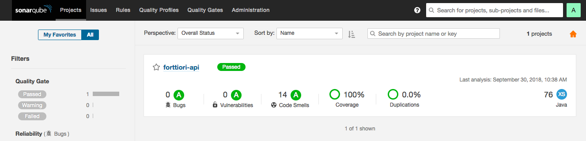

# API Spring Jdk 10

- Project stack
    - JDK 10
    - JUnit
    - Spring WebFlux
    - Maven Multi-module
    - Jacoco
    - Sonarqube
 

### Start Sonarqube

- Enter in the folder docker-sonarqube and execute the below command:
 
```
docker-compose up
```


### Run Maven

```
mvn clean test sonar:sonar -Dsonar.login=admin -Dsonar.password=admin

``` 

### Sonarqube
- http://localhost:9000



