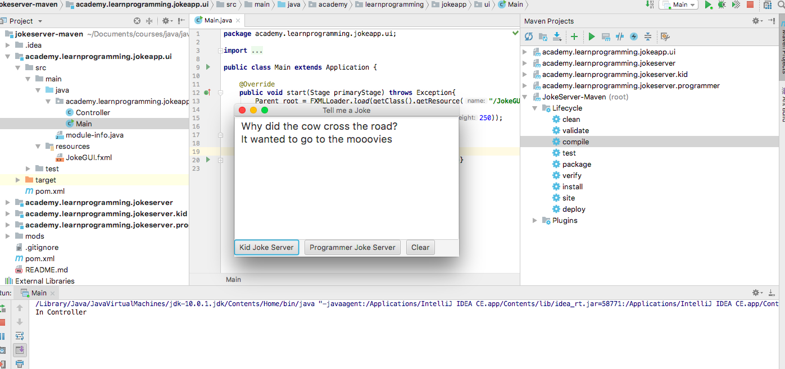
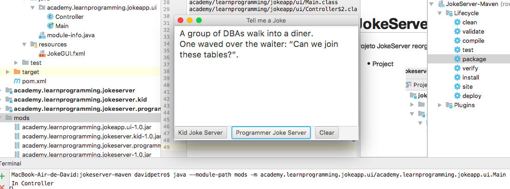

# JokeServer-Maven

Project JokeServer reorganized with maven.

- Project reorganize


### create mods jar

```
$ mvn package
```

### View academy.learnprogramming.jokeapp.ui-1.0.jar

```
$ jar tf mods/academy.learnprogramming.jokeapp.ui-1.0.jar
META-INF/MANIFEST.MF
META-INF/
academy/
academy/learnprogramming/
academy/learnprogramming/jokeapp/
academy/learnprogramming/jokeapp/ui/
JokeGUI.fxml
academy/learnprogramming/jokeapp/ui/Controller$1.class
academy/learnprogramming/jokeapp/ui/Controller.class
module-info.class
academy/learnprogramming/jokeapp/ui/Main.class
academy/learnprogramming/jokeapp/ui/Controller$2.class

```

### Describe module academy.learnprogramming.jokeapp.ui-1.0.jar

```
$ ja --describe-module --file mods/academy.learnprogramming.jokeapp.ui-1.0.jar
academy.learnprogramming.jokeapp.ui jar:file:///Users/davidpetro/Documents/courses/java/java-playground/java9/joke/jokeserver-maven/mods/academy.learnprogramming.jokeapp.ui-1.0.jar/!module-info.class
requires academy.learnprogramming.jokeserver
requires java.base mandated
requires javafx.controls
requires javafx.fxml
uses academy.learnprogramming.jokeserver.JokeServer
qualified opens academy.learnprogramming.jokeapp.ui to javafx.fxml javafx.graphics

```

### run project
```
$ java --module-path mods -m academy.learnprogramming.jokeapp.ui/academy.learnprogramming.jokeapp.ui.Main
```
