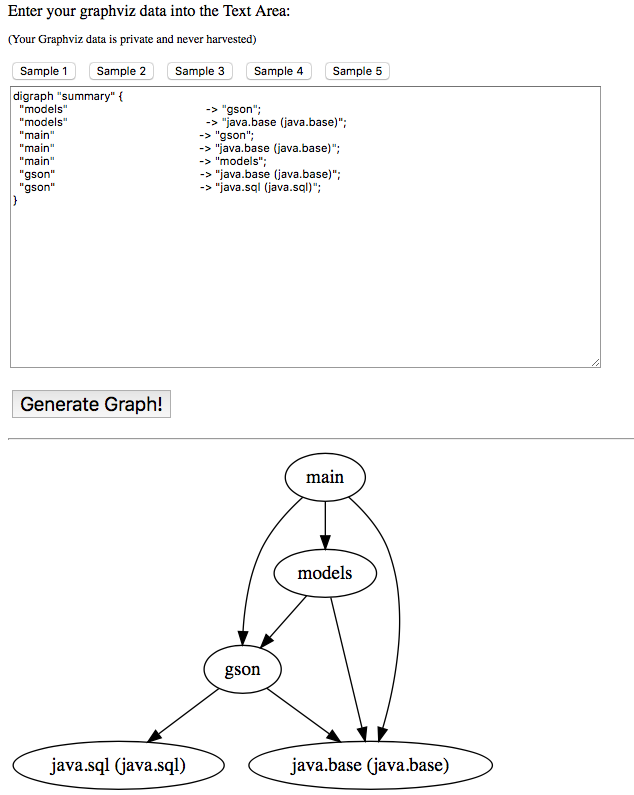

### Generate module info gson
```
$ jdeps --generate-module-info gson-src/gson/src/main/java gson-2.8.1.jar
```

### build gson
```
$ ./build-gson.sh
```

### describe module gson jar
```
$ jar --describe-module --file mods/gson.jar
gson jar:file:///Users/davidpetro/Documents/courses/java/java-playground/java9/The-Java-9-Platform-Module-System-Example-of-Migrating-an-Existing-Application-Part-4-Source-code/mods/gson.jar/!module-info.class
exports com.google.gson
exports com.google.gson.annotations
exports com.google.gson.reflect
exports com.google.gson.stream
requires java.base mandated
requires java.sql transitive
contains com.google.gson.internal
contains com.google.gson.internal.bind
contains com.google.gson.internal.bind.util
```


### compile project
```
./cmpile.sh
```

### run
```
$ ./run.sh
 [
   {
     "id": "S0123",
     "name": "Frank",
     "age": 18,
     "addresses": [
       {
         "street": "123 Main Street",
         "city": "Miami",
         "state": "FL"
       },
       {
         "street": "45 Maple Drive",
         "city": "Ft. Lauderdale",
         "state": "FL"
       }
     ]
   },
   {
     "id": "S0456",
     "name": "James",
     "age": 28,
     "addresses": [
       {
         "street": "45 Madison Avenue",
         "city": "New York",
         "state": "NY"
       }
     ]
   }
 ]

```


### Visulization
```
./dot.sh
```
- copy from summary.dot
```
digraph "summary" {
  "models"                                           -> "gson";
  "models"                                           -> "java.base (java.base)";
  "main"                                             -> "gson";
  "main"                                             -> "java.base (java.base)";
  "main"                                             -> "models";
  "gson"                                             -> "java.base (java.base)";
  "gson"                                             -> "java.sql (java.sql)";
}

```

- go to http://www.webgraphviz.com

