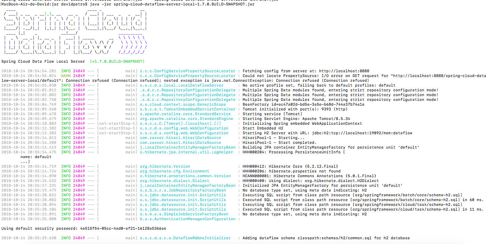
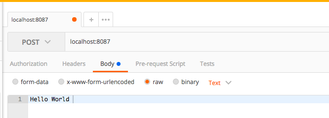
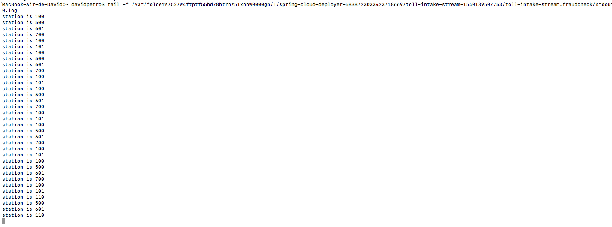

#

### Run databases

```
docker run -d --hostname local-rabbit --name spring-cloud-coordinating-rmq -p 15672:15672 -p 5672:5672 rabbitmq:3.6.9-management

docker run --name spring-cloud-coordinating-mysql  -e MYSQL_ROOT_PASSWORD=123456 -e MYSQL_DATABASE=scdf -d mysql:latest

docker run --name spring-cloud-coordinating-redis  -p 6379:6379 -d redis
```

### Start Server
```
java -jar jar/spring-cloud-dataflow-server-local-1.7.0.BUILD-SNAPSHOT.jar --spring.datasource.url=jdbc:mysql://localhost:3306/scdf --spring.datasource.username=root --spring.datasource.password=123456 --spring.datasource.driver-class-name=org.mariadb.jdbc.Driver --spring.rabbitmq.host=127.0.0.1 --spring.rabbitmq.port=5672 --spring.rabbitmq.username=guest --spring.rabbitmq.password=guest


```



### Start Shell
```
java -jar jar/spring-cloud-dataflow-shell-1.7.0.BUILD-SNAPSHOT.jar
```


### Apps
- http://cloud.spring.io/spring-cloud-stream-app-starters/
- In spring-cloud-dataflow-shell-1.7.0.BUILD-SNAPSHOT.jar install
```
app import --uri http://bit.ly/Celsius-SR3-stream-applications-rabbit-maven
```
- list

```
app list
```


### create stream

```
stream create --definition "http --port=8087 | file --directory=/Users/davidpetro/Documents/courses/java/java-playground/spring/cloud/spring-cloud-dataflow/out --suffix=txt --name=output"--name firstExample-Hello
```

- stream list


- stream deploy
```
stream deploy firstExample-Hello
```

- test stream




### create stream

```
stream create --definition "file --directory=/Users/davidpetro/Documents/courses/java/java-playground/spring/cloud/spring-cloud-dataflow/input --mode=lines | transform --expression=payload+' | procesed=true'| output: file --directory=/Users/davidpetro/Documents/courses/java/java-playground/spring/cloud/spring-cloud-dataflow/out --suffix=txt --nome=output2"--name filestream1
```

- stream deploy

```
stream deploy filestream1
```

- output
```
MacBook-Air-de-David:out davidpetro$ ls
file-sink.txt	output.txt
MacBook-Air-de-David:out davidpetro$ cat file-sink.txt
station:100 | customer:200 | timestamp:2017-07-15T11:41:03 | procesed=true
station:100 | customer:205 | timestamp:2017-07-15T11:46:17 | procesed=true
station:102 | customer:200 | timestamp:2017-07-15T13:00:25 | procesed=true
station:100 | customer:255 | timestamp:2017-07-15T13:05:01 | procesed=true
MacBook-Air-de-David:out davidpetro$
```


### Tasks
- https://cloud.spring.io/spring-cloud-task-app-starters/

- import

```
app import --uri http://bit.ly/Clark-GA-task-applications-maven

app list

╔═══╤══════════════╤═══════════════════════════╤══════════════════════════╤════════════════════╗
║app│    source    │         processor         │           sink           │        task        ║
╠═══╪══════════════╪═══════════════════════════╪══════════════════════════╪════════════════════╣
║   │file          │aggregator                 │aggregate-counter         │composed-task-runner║
║   │ftp           │bridge                     │cassandra                 │jdbchdfs-local      ║
║   │gemfire       │filter                     │counter                   │spark-client        ║
║   │gemfire-cq    │groovy-filter              │field-value-counter       │spark-cluster       ║
║   │http          │groovy-transform           │file                      │spark-yarn          ║
║   │jdbc          │header-enricher            │ftp                       │timestamp           ║
║   │jms           │httpclient                 │gemfire                   │timestamp-batch     ║
║   │load-generator│pmml                       │gpfdist                   │                    ║
║   │loggregator   │python-http                │hdfs                      │                    ║
║   │mail          │python-jython              │hdfs-dataset              │                    ║
║   │mongodb       │scriptable-transform       │jdbc                      │                    ║
║   │mqtt          │splitter                   │log                       │                    ║
║   │rabbit        │tasklaunchrequest-transform│mongodb                   │                    ║
║   │s3            │tcp-client                 │mqtt                      │                    ║
║   │sftp          │tensorflow                 │pgcopy                    │                    ║
║   │syslog        │transform                  │rabbit                    │                    ║
║   │tcp           │twitter-sentiment          │redis-pubsub              │                    ║
║   │tcp-client    │                           │router                    │                    ║
║   │time          │                           │s3                        │                    ║
║   │trigger       │                           │sftp                      │                    ║
║   │triggertask   │                           │task-launcher-cloudfoundry│                    ║
║   │twitterstream │                           │task-launcher-local       │                    ║
║   │              │                           │task-launcher-yarn        │                    ║
║   │              │                           │tcp                       │                    ║
║   │              │                           │throughput                │                    ║
║   │              │                           │websocket                 │                    ║
╚═══╧══════════════╧═══════════════════════════╧══════════════════════════╧════════════════════╝

```

- create

```
task create demotask --definition "timestamp --format=\MM-yy\""
```

- launch
```
task launch demotask
```

- List
```
task execution list
╔═════════╤══╤════════════════════════════╤════════════════════════════╤═════════╗
║Task Name│ID│         Start Time         │          End Time          │Exit Code║
╠═════════╪══╪════════════════════════════╪════════════════════════════╪═════════╣
║demotask │1 │Mon Oct 15 22:10:34 BRT 2018│Mon Oct 15 22:10:34 BRT 2018│0        ║
╚═════════╧══╧════════════════════════════╧════════════════════════════╧═════════╝

```

- test

```
- console log local server

2018-10-15 22:10:23.276  INFO 1833 --- [nio-9393-exec-4] o.s.c.d.spi.local.LocalTaskLauncher      : launching task demotask-17bf0157-0426-4b22-b97a-8f069bc81f0c
   Logs will be in /var/folders/52/w4ftptf55bd78htrhz51xnbw0000gn/T/demotask8238309330101480222/1539652215730/demotask-17bf0157-0426-4b22-b97a-8f069bc81f0c


   cat /var/folders/52/w4ftptf55bd78htrhz51xnbw0000gn/T/demotask8238309330101480222/1539652215730/demotask-17bf0157-0426-4b22-b97a-8f069bc81f0c/stdout.log
   2018-10-15 22:10:28.588  INFO 2070 --- [           main] s.c.a.AnnotationConfigApplicationContext : Refreshing org.springframework.context.annotation.AnnotationConfigApplicationContext@ba8a1dc: startup date [Mon Oct 15 22:10:28 BRT 2018]; root of context hierarchy
   2018-10-15 22:10:29.327  INFO 2070 --- [           main] trationDelegate$BeanPostProcessorChecker : Bean 'configurationPropertiesRebinderAutoConfiguration' of type [org.springframework.cloud.autoconfigure.ConfigurationPropertiesRebinderAutoConfiguration$$EnhancerBySpringCGLIB$$c5ba62e2] is not eligible for getting processed by all BeanPostProcessors (for example: not eligible for auto-proxying)

     .   ____          _            __ _ _
    /\\ / ___'_ __ _ _(_)_ __  __ _ \ \ \ \
   ( ( )\___ | '_ | '_| | '_ \/ _` | \ \ \ \
    \\/  ___)| |_)| | | | | || (_| |  ) ) ) )
     '  |____| .__|_| |_|_| |_\__, | / / / /
    =========|_|==============|___/=/_/_/_/
    :: Spring Boot ::        (v1.5.8.RELEASE)

   2018-10-15 22:10:29.823  INFO 2070 --- [           main] c.c.c.ConfigServicePropertySourceLocator : Fetching config from server at: http://localhost:8888
   2018-10-15 22:10:29.969  WARN 2070 --- [           main] c.c.c.ConfigServicePropertySourceLocator : Could not locate PropertySource: I/O error on GET request for "http://localhost:8888/timestamp-task/default": Connection refused (Connection refused); nested exception is java.net.ConnectException: Connection refused (Connection refused)
   2018-10-15 22:10:29.974  INFO 2070 --- [           main] o.s.c.t.a.t.TimestampTaskApplication     : No active profile set, falling back to default profiles: default
   2018-10-15 22:10:30.008  INFO 2070 --- [           main] s.c.a.AnnotationConfigApplicationContext : Refreshing org.springframework.context.annotation.AnnotationConfigApplicationContext@7bb11784: startup date [Mon Oct 15 22:10:30 BRT 2018]; parent: org.springframework.context.annotation.AnnotationConfigApplicationContext@ba8a1dc
   2018-10-15 22:10:31.097  INFO 2070 --- [           main] o.s.cloud.context.scope.GenericScope     : BeanFactory id=264bad34-0cc7-3abc-8059-630931ec7561
   2018-10-15 22:10:31.276  INFO 2070 --- [           main] trationDelegate$BeanPostProcessorChecker : Bean 'org.springframework.cloud.autoconfigure.ConfigurationPropertiesRebinderAutoConfiguration' of type [org.springframework.cloud.autoconfigure.ConfigurationPropertiesRebinderAutoConfiguration$$EnhancerBySpringCGLIB$$c5ba62e2] is not eligible for getting processed by all BeanPostProcessors (for example: not eligible for auto-proxying)
   2018-10-15 22:10:31.293  INFO 2070 --- [           main] trationDelegate$BeanPostProcessorChecker : Bean 'org.springframework.transaction.annotation.ProxyTransactionManagementConfiguration' of type [org.springframework.transaction.annotation.ProxyTransactionManagementConfiguration$$EnhancerBySpringCGLIB$$a9a05fe5] is not eligible for getting processed by all BeanPostProcessors (for example: not eligible for auto-proxying)
   2018-10-15 22:10:32.495  INFO 2070 --- [           main] o.s.jdbc.datasource.init.ScriptUtils     : Executing SQL script from class path resource [org/springframework/cloud/task/schema-mysql.sql]
   2018-10-15 22:10:32.545  INFO 2070 --- [           main] o.s.jdbc.datasource.init.ScriptUtils     : Executed SQL script from class path resource [org/springframework/cloud/task/schema-mysql.sql] in 49 ms.
   2018-10-15 22:10:33.663  INFO 2070 --- [           main] o.s.j.e.a.AnnotationMBeanExporter        : Registering beans for JMX exposure on startup
   2018-10-15 22:10:33.677  INFO 2070 --- [           main] o.s.j.e.a.AnnotationMBeanExporter        : Bean with name 'configurationPropertiesRebinder' has been autodetected for JMX exposure
   2018-10-15 22:10:33.678  INFO 2070 --- [           main] o.s.j.e.a.AnnotationMBeanExporter        : Bean with name 'environmentManager' has been autodetected for JMX exposure
   2018-10-15 22:10:33.680  INFO 2070 --- [           main] o.s.j.e.a.AnnotationMBeanExporter        : Bean with name 'refreshScope' has been autodetected for JMX exposure
   2018-10-15 22:10:33.683  INFO 2070 --- [           main] o.s.j.e.a.AnnotationMBeanExporter        : Located managed bean 'environmentManager': registering with JMX server as MBean [demotask-17bf0157-0426-4b22-b97a-8f069bc81f0c:name=environmentManager,type=EnvironmentManager]
   2018-10-15 22:10:33.705  INFO 2070 --- [           main] o.s.j.e.a.AnnotationMBeanExporter        : Located managed bean 'refreshScope': registering with JMX server as MBean [demotask-17bf0157-0426-4b22-b97a-8f069bc81f0c:name=refreshScope,type=RefreshScope]
   2018-10-15 22:10:33.733  INFO 2070 --- [           main] o.s.j.e.a.AnnotationMBeanExporter        : Located managed bean 'configurationPropertiesRebinder': registering with JMX server as MBean [demotask-17bf0157-0426-4b22-b97a-8f069bc81f0c:name=configurationPropertiesRebinder,context=7bb11784,type=ConfigurationPropertiesRebinder]
   2018-10-15 22:10:33.917  INFO 2070 --- [           main] o.s.c.support.DefaultLifecycleProcessor  : Starting beans in phase 0
   2018-10-15 22:10:34.135  INFO 2070 --- [           main] TimestampTaskConfiguration$TimestampTask : \10-18"
   2018-10-15 22:10:34.171  INFO 2070 --- [           main] s.c.a.AnnotationConfigApplicationContext : Closing org.springframework.context.annotation.AnnotationConfigApplicationContext@7bb11784: startup date [Mon Oct 15 22:10:30 BRT 2018]; parent: org.springframework.context.annotation.AnnotationConfigApplicationContext@ba8a1dc
   2018-10-15 22:10:34.174  INFO 2070 --- [           main] o.s.c.support.DefaultLifecycleProcessor  : Stopping beans in phase 0
   2018-10-15 22:10:34.178  INFO 2070 --- [           main] o.s.j.e.a.AnnotationMBeanExporter        : Unregistering JMX-exposed beans on shutdown
   2018-10-15 22:10:34.178  INFO 2070 --- [           main] o.s.j.e.a.AnnotationMBeanExporter        : Unregistering JMX-exposed beans
   2018-10-15 22:10:34.190  INFO 2070 --- [           main] o.s.c.t.a.t.TimestampTaskApplication     : Started TimestampTaskApplication in 9.552 seconds (JVM running for 11.068)
   MacBook-Air-de-David:demotask-17bf0157-0426-4b22-b97a-8f069bc81f0c davidpetro$

```


```
stream create --definition "file --directory=/Users/davidpetro/Documents/courses/java/java-playground/spring/cloud/spring-cloud-dataflow/input --mode=lines | transform --expression=payload+' | procesed=true'| output: file --directory=/Users/davidpetro/Documents/courses/java/java-playground/spring/cloud/spring-cloud-dataflow/out --suffix=txt --nome=output2"--name filestream1
```

### Http and splitter example

- create by terminal
```
stream create toll-stream --definition "http --port=8086 | split-JSON: splitter --expression=\"#jsonPath(payload,'$.station.readings')\" --spring.cloud.stream.bindings.output.contentType='application/json' | log"

stream deploy toll-stream

```

- create by dashboard

```
toll-stream=http --port=8086 | split-JSON: splitter --expression="#jsonPath(payload,'$.station.readings')" --spring.cloud.stream.bindings.output.contentType=application/json | log
```


- Test
  - POST localhost:8086

```
{
    "station": {
        "readings": [
            {
                "stationid":100,
                "customerid":200,
                "timestamp":"2017-07-15T08:09:10"
            },
            {
                "stationid":101,
                "customerid":220,
                "timestamp":"2017-07-15T08:13:55"
            },
            {
                "stationid":110,
                "customerid":210,
                "timestamp":"2017-07-15T08:14:03"
            },
            {
                "stationid":500,
                "customerid":200,
                "timestamp":"2017-07-15T08:09:10"
            },
            {
                "stationid":601,
                "customerid":220,
                "timestamp":"2017-07-15T08:13:55"
            },
            {
                "stationid":110,
                "customerid":210,
                "timestamp":"2017-07-15T08:14:03"
            }
        ]
    }
}
```




