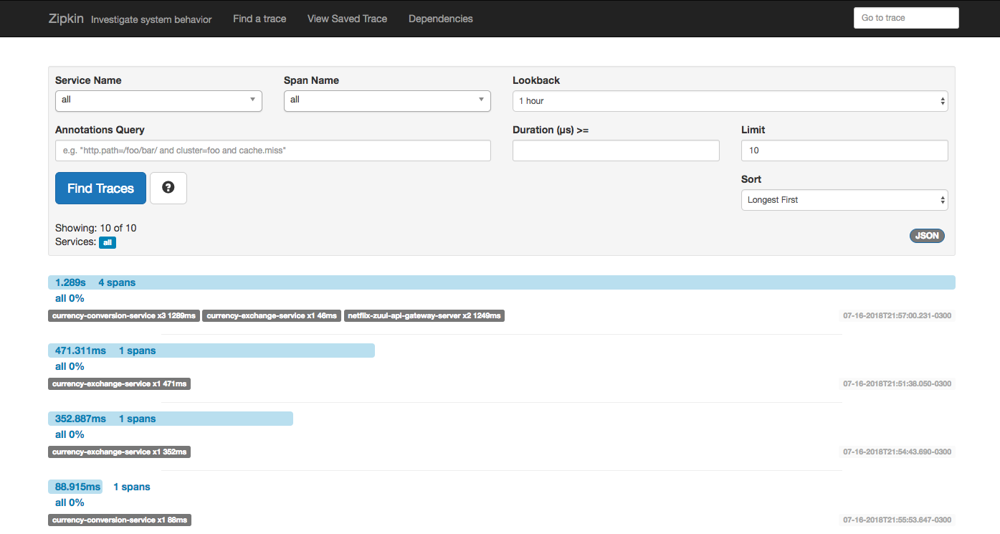
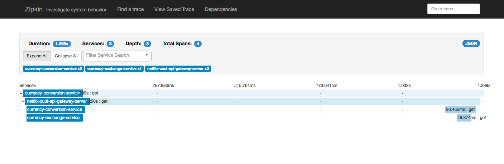
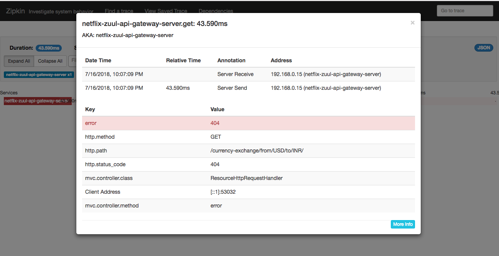

# lab-8

## Dependencies

### rabbitmq
```
docker stop rabbitmq|| true && docker rm rabbitmq || true && docker run -d --hostname localhost --name rabbitmq -p 5672:5672 -p 15672:15672 rabbitmq:3-management

```


### zipkin
```
RABBIT_ADDRESSES=localhost java -jar zipkin.jar
```







## Ports

|     Application       |     Port          |
| ------------- | ------------- |
| Limits Service | 8080, 8081, ... |
| Spring Cloud Config Server | 8888 |
| Currency Exchange Service | 8000, 8001, 8002, ..  |
| Currency Conversion Service | 8100, 8101, 8102, ... |
| Netflix Eureka Naming Server | 8761 |
| Netflix Zuul API Gateway Server | 8765 |
| Zipkin Distributed Tracing Server | 9411 |

