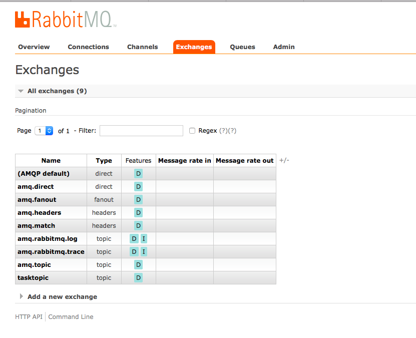

#pluralsight-springcloud-m3-taskintake

### Start RabbitMQ
- docker run -d --hostname local-rabbit --name spring-cloud-taskintake-rmq -p 15672:15672 -p 5672:5672 rabbitmq:3.6.9-management

### Dependencies 
 
- 1) pluralsight-springcloud-m3-task  -> Install project pluralsight-springcloud-m3-task
```
mvn install
```

- 2) pluralsight-springcloud-m3-tasksink  -> run

### GET - http://localhost:15672/#/exchanges


### POST - localhost:8082/tasks
- BODY 
```
station100, DAVID, 2016-10-12T07:44:22
```
 