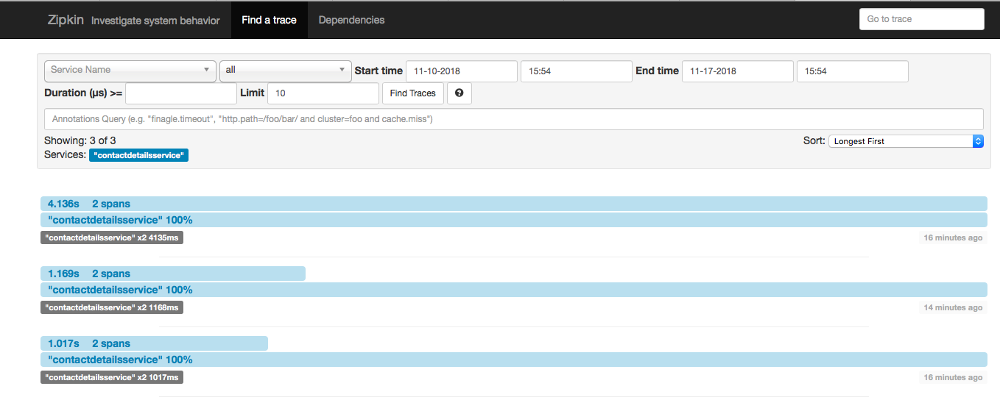
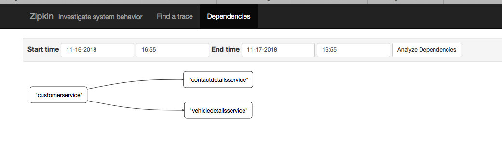

# pluralsight-springcloud-m5-zipkinserver

### projects dependencies
- pluralsight-springcloud-m5-customerservice
- pluralsight-springcloud-m5-dataservice1
- pluralsight-springcloud-m5-dataservice2

### GET - http://localhost:8085/?serviceName=%22contactdetailsservice%22&spanName=all&startTs=1541872465629&endTs=1542477265629&minDuration=&limit=10&annotationQuery=

### GET - http://localhost:8085/dependency

