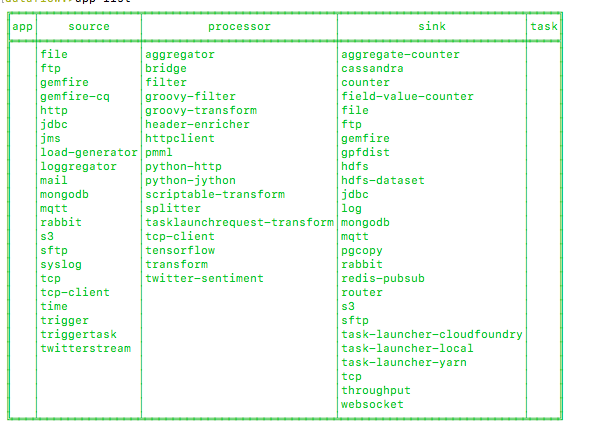
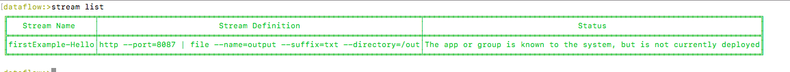
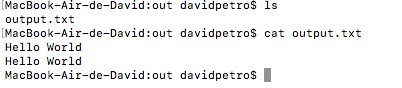

#

### Run databases
docker run -d --hostname local-rabbit --name spring-cloud-coordinating-rmq -p 15672:15672 -p 5672:5672 rabbitmq:3.6.9-management
docker run --name spring-cloud-coordinating-mysql  -e MYSQL_ROOT_PASSWORD=123456 -e MYSQL_DATABASE=scdf -d mysql:latest
docker run --name spring-cloud-coordinating-redis  -p 6379:6379 -d redis


### Start Server
```
java -jar jar/spring-cloud-dataflow-server-local-1.7.0.BUILD-SNAPSHOT.jar --spring.datasource.url=jdbc:mysql://localhost:3306/scdf --spring.datasource.username=root --spring.datasource.password=123456 --spring.datasource.driver-class-name=org.mariadb.jdbc.Driver --spring.rabbitmq.host=127.0.0.1 --spring.rabbitmq.port=5672 --spring.rabbitmq.username=guest --spring.rabbitmq.password=guest


```


### Start Shell
```
java -jar jar/spring-cloud-dataflow-shell-1.7.0.BUILD-SNAPSHOT.jar
```


### Apps
- http://cloud.spring.io/spring-cloud-stream-app-starters/
- In spring-cloud-dataflow-shell-1.7.0.BUILD-SNAPSHOT.jar install
```
app import --uri http://bit.ly/Celsius-SR3-stream-applications-rabbit-maven
```
- list

```
app list
```


### create stream

```
stream create --definition "http --port=8087 | file --directory=/Users/davidpetro/Documents/courses/java/java-playground/spring/cloud/spring-cloud-dataflow/out --suffix=txt --name=output"--name firstExample-Hello
```

- stream list


- stream deploy
```
stream deploy firstExample-Hello
```

- test stream




### create stream
```
stream create --definition "file --directory=/Users/davidpetro/Documents/courses/java/java-playground/spring/cloud/spring-cloud-dataflow/input --mode=lines | transform --expression=payload+' | procesed=true'| output: file --directory=/Users/davidpetro/Documents/courses/java/java-playground/spring/cloud/spring-cloud-dataflow/out --suffix=txt --nome=output2"--name filestream1
```
- stream deploy
```
stream deploy filestream1
```

- output
```
MacBook-Air-de-David:out davidpetro$ ls
file-sink.txt	output.txt
MacBook-Air-de-David:out davidpetro$ cat file-sink.txt
station:100 | customer:200 | timestamp:2017-07-15T11:41:03 | procesed=true
station:100 | customer:205 | timestamp:2017-07-15T11:46:17 | procesed=true
station:102 | customer:200 | timestamp:2017-07-15T13:00:25 | procesed=true
station:100 | customer:255 | timestamp:2017-07-15T13:05:01 | procesed=true
MacBook-Air-de-David:out davidpetro$
```
