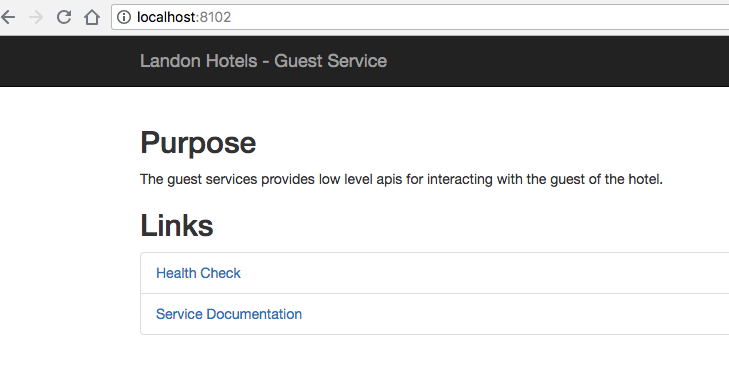

#guest-services

* Get http://localhost:8102/


* Get http://localhost:8102/swagger-ui.html
 

* http://localhost:8102/guests

```
[
    {
        "id": 1,
        "firstName": "Roy",
        "lastName": "Adams",
        "emailAddress": "radams1v@xinhuanet.com",
        "address": "2872 Marquette Street",
        "country": "United States",
        "state": "NY",
        "phoneNumber": "1-(235)314-9823"
    },
    {
        "id": 2,
        "firstName": "Martin",
        "lastName": "Adams",
        "emailAddress": "madams2b@msu.edu",
        "address": "4 Mandrake Plaza",
        "country": "China",
        "state": "",
        "phoneNumber": "9-(401)660-9813"
    },
    {
        "id": 3,
        "firstName": "Roger",
        "lastName": "Alvarez",
        "emailAddress": "ralvarezk@blogs.com",
        "address": "3 Green Plaza",
        "country": "United States",
        "state": "FL",
        "phoneNumber": "6-(980)036-6105"
    },
    {
        "id": 4,
        "firstName": "Anne",
        "lastName": "Alvarez",
        "emailAddress": "aalvarez1y@mlb.com",
        "address": "6 Glendale Parkway",
        "country": "United States",
        "state": "FL",
        "phoneNumber": "7-(967)349-7237"
    },
    {
        "id": 5,
        "firstName": "Ann",
        "lastName": "Alvarez",
        "emailAddress": "aalvarez20@jalbum.net",
        "address": "851 Nelson Circle",
        "country": "Afghanistan",
        "state": "",
        "phoneNumber": "7-(418)731-2327"
    },
    {
        "id": 6,
        "firstName": "Betty",
        "lastName": "Anderson",
        "emailAddress": "banderson14@digg.com",
        "address": "3538 Scofield Drive",
        "country": "United States",
        "state": "TX",
        "phoneNumber": "1-(291)830-0405"
    },
    {
        "id": 7,
        "firstName": "Laura",
        "lastName": "Anderson",
        "emailAddress": "landerson24@icio.us",
        "address": "805 Paget Court",
        "country": "United States",
        "state": "NY",
        "phoneNumber": "3-(587)240-6409"
    },
    {
        "id": 8,
        "firstName": "Christopher",
        "lastName": "Armstrong",
        "emailAddress": "carmstrong2p@cyberchimps.com",
        "address": "4514 Independence Point",
        "country": "United States",
        "state": "TX",
        "phoneNumber": "3-(411)160-3757"
    },
    {
        "id": 9,
        "firstName": "David",
        "lastName": "Bell",
        "emailAddress": "dbell2l@wp.com",
        "address": "5205 Vera Junction",
        "country": "United States",
        "state": "CA",
        "phoneNumber": "8-(035)412-4547"
    },
    {
        "id": 10,
        "firstName": "Paula",
        "lastName": "Berry",
        "emailAddress": "pberry1z@admin.ch",
        "address": "5095 International Drive",
        "country": "China",
        "state": "",
        "phoneNumber": "6-(195)796-7745"
    },
    {
        "id": 11,
        "firstName": "Dennis",
        "lastName": "Bishop",
        "emailAddress": "dbishopo@xinhuanet.com",
        "address": "11442 East Circle",
        "country": "Armenia",
        "state": "",
        "phoneNumber": "4-(871)489-3543"
    },
    {
        "id": 12,
        "firstName": "Carolyn",
        "lastName": "Bishop",
        "emailAddress": "cbishopw@1688.com",
        "address": "23273 Emmet Road",
        "country": "Ukraine",
        "state": "",
        "phoneNumber": "5-(795)729-5690"
    },
    {
        "id": 13,
        "firstName": "Harold",
        "lastName": "Black",
        "emailAddress": "hblack2p@clickbank.net",
        "address": "7715 Havey Center",
        "country": "Indonesia",
        "state": "",
        "phoneNumber": "0-(378)142-3343"
    },
    {
        "id": 14,
        "firstName": "Jerry",
        "lastName": "Bowman",
        "emailAddress": "jbowman1j@fotki.com",
        "address": "49381 Northridge Point",
        "country": "Indonesia",
        "state": "",
        "phoneNumber": "9-(389)678-8585"
    },
    {
        "id": 15,
        "firstName": "Keith",
        "lastName": "Bradley",
        "emailAddress": "kbradley1c@techcrunch.com",
        "address": "21 Sauthoff Point",
        "country": "United States",
        "state": "OH",
        "phoneNumber": "5-(780)609-5353"
    },
    {
        "id": 16,
        "firstName": "Samuel",
        "lastName": "Brooks",
        "emailAddress": "sbrooks4@google.co.uk",
        "address": "9857 Hollow Ridge Park",
        "country": "United States",
        "state": "PA",
        "phoneNumber": "5-(517)250-0437"
    },
    {
        "id": 17,
        "firstName": "Donald",
        "lastName": "Bryant",
        "emailAddress": "dbryant1@cdbaby.com",
        "address": "8 Crescent Oaks Circle",
        "country": "South Korea",
        "state": "",
        "phoneNumber": "5-(629)251-0019"
    },
    {
        "id": 18,
        "firstName": "Tammy",
        "lastName": "Burke",
        "emailAddress": "tburke2a@theglobeandmail.com",
        "address": "7298 Bluejay Road",
        "country": "Russia",
        "state": "",
        "phoneNumber": "8-(710)063-1619"
    },
    {
        "id": 19,
        "firstName": "Joe",
        "lastName": "Burns",
        "emailAddress": "jburns18@mail.ru",
        "address": "2795 Lighthouse Bay Place",
        "country": "Russia",
        "state": "",
        "phoneNumber": "3-(465)132-7455"
    },
    {
        "id": 20,
        "firstName": "Jessica",
        "lastName": "Campbell",
        "emailAddress": "jcampbell2i@cpanel.net",
        "address": "7963 Ohio Alley",
        "country": "United States",
        "state": "OR",
        "phoneNumber": "0-(150)386-2177"
    },
    {
        "id": 21,
        "firstName": "Christopher",
        "lastName": "Campbell",
        "emailAddress": "ccampbell2i@amazon.de",
        "address": "6 Walton Court",
        "country": "Russia",
        "state": "",
        "phoneNumber": "5-(275)117-4811"
    },
    {
        "id": 22,
        "firstName": "Pamela",
        "lastName": "Carpenter",
        "emailAddress": "pcarpenterj@china.com.cn",
        "address": "661 Karstens Road",
        "country": "United States",
        "state": "HI",
        "phoneNumber": "6-(268)816-2465"
    },
    {
        "id": 23,
        "firstName": "Paul",
        "lastName": "Carpenter",
        "emailAddress": "pcarpenter28@dropbox.com",
        "address": "33614 Cambridge Road",
        "country": "Philippines",
        "state": "",
        "phoneNumber": "3-(561)990-7094"
    },
    {
        "id": 24,
        "firstName": "Tammy",
        "lastName": "Carter",
        "emailAddress": "tcarter1j@washington.edu",
        "address": "3 Leroy Crossing",
        "country": "United States",
        "state": "TN",
        "phoneNumber": "7-(489)865-7002"
    },
    {
        "id": 25,
        "firstName": "Paul",
        "lastName": "Carter",
        "emailAddress": "pcarter1z@cnet.com",
        "address": "3 Green Plaza",
        "country": "United States",
        "state": "CA",
        "phoneNumber": "3-(854)158-1783"
    },
    {
        "id": 26,
        "firstName": "Justin",
        "lastName": "Chapman",
        "emailAddress": "jchapmans@aol.com",
        "address": "2127 David Lane",
        "country": "United States",
        "state": "WV",
        "phoneNumber": "1-(910)152-0295"
    },
    {
        "id": 27,
        "firstName": "Margaret",
        "lastName": "Chapman",
        "emailAddress": "mchapmanb@hud.gov",
        "address": "953 Reindahl Parkway",
        "country": "Canada",
        "state": "",
        "phoneNumber": "1-(010)495-9996"
    },
    {
        "id": 28,
        "firstName": "Bonnie",
        "lastName": "Clark",
        "emailAddress": "bclark6@bing.com",
        "address": "4 Porter Avenue",
        "country": "United States",
        "state": "CO",
        "phoneNumber": "9-(524)812-6248"
    },
    {
        "id": 29,
        "firstName": "Andrea",
        "lastName": "Clark",
        "emailAddress": "aclark2j@sphinn.com",
        "address": "02 Haas Park",
        "country": "United States",
        "state": "MI",
        "phoneNumber": "1-(123)323-9494"
    },
    {
        "id": 30,
        "firstName": "Shirley",
        "lastName": "Coleman",
        "emailAddress": "scoleman26@bizjournals.com",
        "address": "4903 Commercial Drive",
        "country": "United States",
        "state": "AL",
        "phoneNumber": "7-(798)598-1459"
    },
    {
        "id": 31,
        "firstName": "Angela",
        "lastName": "Coleman",
        "emailAddress": "acoleman6@gmpg.org",
        "address": "1208 Menomonie Terrace",
        "country": "Russia",
        "state": "",
        "phoneNumber": "9-(959)063-5551"
    },
    {
        "id": 32,
        "firstName": "Harold",
        "lastName": "Cox",
        "emailAddress": "hcox23@dyndns.org",
        "address": "08 Butterfield Place",
        "country": "France",
        "state": "B5",
        "phoneNumber": "6-(983)957-3202"
    },
    {
        "id": 33,
        "firstName": "Alan",
        "lastName": "Cruz",
        "emailAddress": "acruzj@marketwatch.com",
        "address": "023 Laurel Terrace",
        "country": "China",
        "state": "",
        "phoneNumber": "1-(003)990-0308"
    },
    {
        "id": 34,
        "firstName": "Anna",
        "lastName": "Cunningham",
        "emailAddress": "acunningham2@yale.edu",
        "address": "1 Steensland Lane",
        "country": "China",
        "state": "",
        "phoneNumber": "7-(769)474-5961"
    },
    {
        "id": 35,
        "firstName": "Robin",
        "lastName": "Daniels",
        "emailAddress": "rdaniels2d@weebly.com",
        "address": "9728 Paget Court",
        "country": "United States",
        "state": "AR",
        "phoneNumber": "7-(116)447-5902"
    },
    {
        "id": 36,
        "firstName": "Phillip",
        "lastName": "Daniels",
        "emailAddress": "pdaniels1y@hexun.com",
        "address": "5 Blue Bill Park Trail",
        "country": "Kazakhstan",
        "state": "",
        "phoneNumber": "4-(029)713-9304"
    },
    {
        "id": 37,
        "firstName": "Thomas",
        "lastName": "Davis",
        "emailAddress": "tdavis1h@globo.com",
        "address": "6332 Fuller Pass",
        "country": "United States",
        "state": "TX",
        "phoneNumber": "5-(778)054-9695"
    },
    {
        "id": 38,
        "firstName": "Joe",
        "lastName": "Dean",
        "emailAddress": "jdeanp@vinaora.com",
        "address": "8 Darwin Crossing",
        "country": "United States",
        "state": "AZ",
        "phoneNumber": "9-(625)975-9705"
    },
    {
        "id": 39,
        "firstName": "Sara",
        "lastName": "Dean",
        "emailAddress": "sdean1t@unc.edu",
        "address": "9 South Crossing",
        "country": "Mexico",
        "state": "GUA",
        "phoneNumber": "7-(206)725-7117"
    },
    {
        "id": 40,
        "firstName": "Patricia",
        "lastName": "Dixon",
        "emailAddress": "pdixon2m@biglobe.ne.jp",
        "address": "49 Moose Way",
        "country": "United States",
        "state": "DC",
        "phoneNumber": "1-(159)384-4102"
    },
    {
        "id": 41,
        "firstName": "Cynthia",
        "lastName": "Dixon",
        "emailAddress": "cdixon1e@vimeo.com",
        "address": "52645 Dorton Pass",
        "country": "China",
        "state": "",
        "phoneNumber": "6-(422)372-7084"
    },
    {
        "id": 42,
        "firstName": "Todd",
        "lastName": "Dixon",
        "emailAddress": "tdixon2o@ed.gov",
        "address": "82172 Lukken Alley",
        "country": "China",
        "state": "",
        "phoneNumber": "0-(290)722-9657"
    },
    {
        "id": 43,
        "firstName": "David",
        "lastName": "Elliott",
        "emailAddress": "delliottn@wsj.com",
        "address": "6478 Doe Crossing Court",
        "country": "Russia",
        "state": "",
        "phoneNumber": "4-(687)980-5138"
    },
    {
        "id": 44,
        "firstName": "Gregory",
        "lastName": "Elliott",
        "emailAddress": "gelliott2f@exblog.jp",
        "address": "01298 Raven Alley",
        "country": "Indonesia",
        "state": "",
        "phoneNumber": "2-(826)961-5278"
    },
    {
        "id": 45,
        "firstName": "James",
        "lastName": "Ellis",
        "emailAddress": "jellisa@wordpress.com",
        "address": "8108 Upham Avenue",
        "country": "United States",
        "state": "CA",
        "phoneNumber": "9-(104)768-0365"
    },
    {
        "id": 46,
        "firstName": "Russell",
        "lastName": "Ferguson",
        "emailAddress": "rferguson1b@uol.com.br",
        "address": "9143 Hudson Terrace",
        "country": "United States",
        "state": "OH",
        "phoneNumber": "7-(498)208-8970"
    },
    {
        "id": 47,
        "firstName": "Mark",
        "lastName": "Ferguson",
        "emailAddress": "mferguson2m@columbia.edu",
        "address": "6 Fisk Drive",
        "country": "Poland",
        "state": "",
        "phoneNumber": "7-(920)445-0162"
    },
    {
        "id": 48,
        "firstName": "Lori",
        "lastName": "Fields",
        "emailAddress": "lfieldsq@smh.com.au",
        "address": "76485 Roth Alley",
        "country": "United States",
        "state": "WA",
        "phoneNumber": "2-(229)182-4243"
    },
    {
        "id": 49,
        "firstName": "Thomas",
        "lastName": "Fisher",
        "emailAddress": "tfisher26@sina.com.cn",
        "address": "8 Haas Avenue",
        "country": "Uzbekistan",
        "state": "",
        "phoneNumber": "1-(842)637-0935"
    },
    {
        "id": 50,
        "firstName": "Matthew",
        "lastName": "Ford",
        "emailAddress": "mfordi@ucoz.com",
        "address": "63 East Place",
        "country": "Syria",
        "state": "",
        "phoneNumber": "5-(508)161-9676"
    },
    {
        "id": 51,
        "firstName": "Clarence",
        "lastName": "Fowler",
        "emailAddress": "cfowler1t@unicef.org",
        "address": "890 Nevada Road",
        "country": "United States",
        "state": "CT",
        "phoneNumber": "5-(922)750-2234"
    },
    {
        "id": 52,
        "firstName": "Steve",
        "lastName": "Fowler",
        "emailAddress": "sfowler2f@ed.gov",
        "address": "243 Ohio Plaza",
        "country": "United States",
        "state": "AL",
        "phoneNumber": "8-(435)340-9290"
    },
    {
        "id": 53,
        "firstName": "Craig",
        "lastName": "Fox",
        "emailAddress": "cfox1v@sakura.ne.jp",
        "address": "576 Novick Alley",
        "country": "Philippines",
        "state": "",
        "phoneNumber": "3-(453)987-1524"
    },
    {
        "id": 54,
        "firstName": "Kimberly",
        "lastName": "Freeman",
        "emailAddress": "kfreemank@cmu.edu",
        "address": "46613 Buena Vista Pass",
        "country": "Australia",
        "state": "NSW",
        "phoneNumber": "0-(289)984-9766"
    },
    {
        "id": 55,
        "firstName": "Johnny",
        "lastName": "Freeman",
        "emailAddress": "jfreeman1g@aboutads.info",
        "address": "719 Trailsway Street",
        "country": "China",
        "state": "",
        "phoneNumber": "6-(658)139-7764"
    },
    {
        "id": 56,
        "firstName": "Carl",
        "lastName": "Garza",
        "emailAddress": "cgarzal@friendfeed.com",
        "address": "92 Scott Court",
        "country": "United States",
        "state": "DC",
        "phoneNumber": "2-(818)774-1651"
    },
    {
        "id": 57,
        "firstName": "Martha",
        "lastName": "Garza",
        "emailAddress": "mgarza29@fastcompany.com",
        "address": "64 Farwell Circle",
        "country": "Philippines",
        "state": "",
        "phoneNumber": "9-(455)359-2298"
    },
    {
        "id": 58,
        "firstName": "Angela",
        "lastName": "George",
        "emailAddress": "ageorgew@slashdot.org",
        "address": "1 Corben Street",
        "country": "United States",
        "state": "MD",
        "phoneNumber": "5-(864)699-8310"
    },
    {
        "id": 59,
        "firstName": "Linda",
        "lastName": "George",
        "emailAddress": "lgeorge27@mtv.com",
        "address": "5793 Northport Center",
        "country": "United States",
        "state": "MI",
        "phoneNumber": "7-(899)692-4554"
    },
    {
        "id": 60,
        "firstName": "Rose",
        "lastName": "Gilbert",
        "emailAddress": "rgilbert1c@java.com",
        "address": "32441 Oriole Junction",
        "country": "Indonesia",
        "state": "",
        "phoneNumber": "9-(771)659-3359"
    },
    {
        "id": 61,
        "firstName": "Jacqueline",
        "lastName": "Gomez",
        "emailAddress": "jgomeze@miitbeian.gov.cn",
        "address": "794 Armistice Crossing",
        "country": "France",
        "state": "A7",
        "phoneNumber": "9-(345)143-4371"
    },
    {
        "id": 62,
        "firstName": "Antonio",
        "lastName": "Gordon",
        "emailAddress": "agordon28@weather.com",
        "address": "8 Maywood Parkway",
        "country": "United States",
        "state": "CA",
        "phoneNumber": "5-(724)135-8826"
    },
    {
        "id": 63,
        "firstName": "Raymond",
        "lastName": "Grant",
        "emailAddress": "rgrant11@amazonaws.com",
        "address": "248 Scott Trail",
        "country": "China",
        "state": "",
        "phoneNumber": "0-(001)715-0415"
    },
    {
        "id": 64,
        "firstName": "Janet",
        "lastName": "Grant",
        "emailAddress": "jgrant2c@nbcnews.com",
        "address": "07 Schurz Circle",
        "country": "Philippines",
        "state": "",
        "phoneNumber": "3-(757)166-1573"
    },
    {
        "id": 65,
        "firstName": "Steven",
        "lastName": "Gray",
        "emailAddress": "sgray17@over-blog.com",
        "address": "4 5th Street",
        "country": "Sweden",
        "state": "AB",
        "phoneNumber": "8-(004)861-6730"
    },
    {
        "id": 66,
        "firstName": "William",
        "lastName": "Hamilton",
        "emailAddress": "whamilton2a@biglobe.ne.jp",
        "address": "23 Ronald Regan Drive",
        "country": "United States",
        "state": "MO",
        "phoneNumber": "7-(178)515-6650"
    },
    {
        "id": 67,
        "firstName": "Ernest",
        "lastName": "Hamilton",
        "emailAddress": "ehamilton0@51.la",
        "address": "3 Bay Park",
        "country": "Poland",
        "state": "",
        "phoneNumber": "1-(402)667-5979"
    },
    {
        "id": 68,
        "firstName": "Jane",
        "lastName": "Hansen",
        "emailAddress": "jhansen0@xrea.com",
        "address": "8 Beilfuss Place",
        "country": "United States",
        "state": "SC",
        "phoneNumber": "8-(468)743-8087"
    },
    {
        "id": 69,
        "firstName": "Annie",
        "lastName": "Hansen",
        "emailAddress": "ahansen7@furl.net",
        "address": "728 Fisk Plaza",
        "country": "United States",
        "state": "MD",
        "phoneNumber": "3-(527)508-7158"
    },
    {
        "id": 70,
        "firstName": "Carolyn",
        "lastName": "Hanson",
        "emailAddress": "chanson1r@netlog.com",
        "address": "5066 Dottie Junction",
        "country": "United States",
        "state": "NY",
        "phoneNumber": "8-(597)931-5162"
    },
    {
        "id": 71,
        "firstName": "Christopher",
        "lastName": "Hanson",
        "emailAddress": "chansonp@ftc.gov",
        "address": "50 Claremont Crossing",
        "country": "Indonesia",
        "state": "",
        "phoneNumber": "5-(759)595-6039"
    },
    {
        "id": 72,
        "firstName": "Michael",
        "lastName": "Harris",
        "emailAddress": "mharris2g@printfriendly.com",
        "address": "43 Veith Parkway",
        "country": "United States",
        "state": "CT",
        "phoneNumber": "2-(345)753-2214"
    },
    {
        "id": 73,
        "firstName": "Stephanie",
        "lastName": "Harrison",
        "emailAddress": "sharrison21@devhub.com",
        "address": "709 Pepper Wood Avenue",
        "country": "Poland",
        "state": "",
        "phoneNumber": "1-(280)302-4944"
    },
    {
        "id": 74,
        "firstName": "Anne",
        "lastName": "Harvey",
        "emailAddress": "aharvey2g@sfgate.com",
        "address": "4 American Place",
        "country": "China",
        "state": "",
        "phoneNumber": "9-(535)847-7555"
    },
    {
        "id": 75,
        "firstName": "Barbara",
        "lastName": "Hayes",
        "emailAddress": "bhayes2q@jiathis.com",
        "address": "6 Scofield Circle",
        "country": "United States",
        "state": "TX",
        "phoneNumber": "0-(173)195-7190"
    },
    {
        "id": 76,
        "firstName": "Nicole",
        "lastName": "Hayes",
        "emailAddress": "nhayes10@qq.com",
        "address": "98830 Schlimgen Park",
        "country": "China",
        "state": "",
        "phoneNumber": "7-(755)477-0983"
    },
    {
        "id": 77,
        "firstName": "Emily",
        "lastName": "Hayes",
        "emailAddress": "ehayes1h@ox.ac.uk",
        "address": "784 Susan Street",
        "country": "Indonesia",
        "state": "",
        "phoneNumber": "8-(944)943-0482"
    },
    {
        "id": 78,
        "firstName": "Martin",
        "lastName": "Henderson",
        "emailAddress": "mhenderson16@wsj.com",
        "address": "7306 Buhler Plaza",
        "country": "United States",
        "state": "TX",
        "phoneNumber": "6-(058)886-9240"
    },
    {
        "id": 79,
        "firstName": "Billy",
        "lastName": "Hernandez",
        "emailAddress": "bhernandezx@sphinn.com",
        "address": "994 Kennedy Street",
        "country": "United States",
        "state": "PA",
        "phoneNumber": "2-(728)757-6883"
    },
    {
        "id": 80,
        "firstName": "Heather",
        "lastName": "Hernandez",
        "emailAddress": "hhernandezr@hostgator.com",
        "address": "74 Clove Drive",
        "country": "Indonesia",
        "state": "",
        "phoneNumber": "5-(593)151-3362"
    },
    {
        "id": 81,
        "firstName": "Sharon",
        "lastName": "Hicks",
        "emailAddress": "shicks3@wsj.com",
        "address": "0974 Calypso Junction",
        "country": "Indonesia",
        "state": "",
        "phoneNumber": "3-(868)311-6209"
    },
    {
        "id": 82,
        "firstName": "Lori",
        "lastName": "Hicks",
        "emailAddress": "lhicks9@wordpress.org",
        "address": "854 Lakewood Gardens Court",
        "country": "China",
        "state": "",
        "phoneNumber": "9-(849)992-9828"
    },
    {
        "id": 83,
        "firstName": "Richard",
        "lastName": "Howard",
        "emailAddress": "rhoward1i@theatlantic.com",
        "address": "6 Welch Pass",
        "country": "United States",
        "state": "CA",
        "phoneNumber": "5-(673)015-8549"
    },
    {
        "id": 84,
        "firstName": "Ronald",
        "lastName": "Howell",
        "emailAddress": "rhowell13@soup.io",
        "address": "75904 Hoffman Way",
        "country": "Japan",
        "state": "",
        "phoneNumber": "3-(124)276-4530"
    },
    {
        "id": 85,
        "firstName": "Judy",
        "lastName": "Hughes",
        "emailAddress": "jhughes25@4shared.com",
        "address": "03 Sullivan Circle",
        "country": "United States",
        "state": "DE",
        "phoneNumber": "4-(702)002-3923"
    },
    {
        "id": 86,
        "firstName": "Amy",
        "lastName": "Hunter",
        "emailAddress": "ahuntere@intel.com",
        "address": "9781 Kennedy Avenue",
        "country": "United States",
        "state": "WV",
        "phoneNumber": "0-(992)102-4834"
    },
    {
        "id": 87,
        "firstName": "Kathryn",
        "lastName": "Jackson",
        "emailAddress": "kjackson3@wikia.com",
        "address": "43603 Northwestern Plaza",
        "country": "United States",
        "state": "MS",
        "phoneNumber": "9-(266)577-1031"
    },
    {
        "id": 88,
        "firstName": "Steven",
        "lastName": "Jenkins",
        "emailAddress": "sjenkins1e@a8.net",
        "address": "7396 Canary Center",
        "country": "United States",
        "state": "CA",
        "phoneNumber": "3-(613)563-6513"
    },
    {
        "id": 89,
        "firstName": "Kevin",
        "lastName": "Johnson",
        "emailAddress": "kjohnson2h@unesco.org",
        "address": "5 Haas Circle",
        "country": "Poland",
        "state": "",
        "phoneNumber": "8-(553)359-6387"
    },
    {
        "id": 90,
        "firstName": "Christina",
        "lastName": "Johnston",
        "emailAddress": "cjohnston1m@nationalgeographic.com",
        "address": "05059 Fordem Lane",
        "country": "Gabon",
        "state": "",
        "phoneNumber": "7-(543)809-5071"
    },
    {
        "id": 91,
        "firstName": "Ryan",
        "lastName": "Johnston",
        "emailAddress": "rjohnston1s@ucla.edu",
        "address": "4 Sunfield Avenue",
        "country": "Russia",
        "state": "",
        "phoneNumber": "3-(807)624-4323"
    },
    {
        "id": 92,
        "firstName": "Marie",
        "lastName": "Jordan",
        "emailAddress": "mjordan1n@weather.com",
        "address": "5 Moulton Avenue",
        "country": "United States",
        "state": "GA",
        "phoneNumber": "9-(380)848-6527"
    },
    {
        "id": 93,
        "firstName": "Pamela",
        "lastName": "Kelley",
        "emailAddress": "pkelley2c@hibu.com",
        "address": "97636 5th Pass",
        "country": "United States",
        "state": "KS",
        "phoneNumber": "0-(546)670-0937"
    },
    {
        "id": 94,
        "firstName": "Evelyn",
        "lastName": "Kelly",
        "emailAddress": "ekelly2h@facebook.com",
        "address": "82091 Leroy Center",
        "country": "United States",
        "state": "KY",
        "phoneNumber": "5-(319)309-1959"
    },
    {
        "id": 95,
        "firstName": "Dorothy",
        "lastName": "Kennedy",
        "emailAddress": "dkennedy23@unblog.fr",
        "address": "01 Park Meadow Place",
        "country": "United States",
        "state": "TX",
        "phoneNumber": "0-(605)308-6131"
    },
    {
        "id": 96,
        "firstName": "Sean",
        "lastName": "King",
        "emailAddress": "skingl@geocities.jp",
        "address": "6611 Spaight Street",
        "country": "Indonesia",
        "state": "",
        "phoneNumber": "5-(463)415-7449"
    },
    {
        "id": 97,
        "firstName": "Kimberly",
        "lastName": "King",
        "emailAddress": "kking1r@naver.com",
        "address": "7 Northfield Avenue",
        "country": "Nigeria",
        "state": "",
        "phoneNumber": "4-(192)264-2329"
    },
    {
        "id": 98,
        "firstName": "Nicholas",
        "lastName": "King",
        "emailAddress": "nking2r@businessweek.com",
        "address": "3 Gulseth Drive",
        "country": "Philippines",
        "state": "",
        "phoneNumber": "4-(647)544-4105"
    },
    {
        "id": 99,
        "firstName": "Katherine",
        "lastName": "Knight",
        "emailAddress": "kknight1p@walmart.com",
        "address": "3 Surrey Circle",
        "country": "United States",
        "state": "LA",
        "phoneNumber": "6-(906)910-4569"
    },
    {
        "id": 100,
        "firstName": "Martin",
        "lastName": "Larson",
        "emailAddress": "mlarson24@tripadvisor.com",
        "address": "32 Surrey Road",
        "country": "United States",
        "state": "NC",
        "phoneNumber": "8-(568)965-0021"
    },
    {
        "id": 101,
        "firstName": "Louis",
        "lastName": "Lee",
        "emailAddress": "lleeh@yellowbook.com",
        "address": "80 Boyd Court",
        "country": "United States",
        "state": "NJ",
        "phoneNumber": "3-(100)131-3147"
    },
    {
        "id": 102,
        "firstName": "Ruby",
        "lastName": "Lewis",
        "emailAddress": "rlewisv@answers.com",
        "address": "37 Saint Paul Place",
        "country": "United States",
        "state": "IA",
        "phoneNumber": "1-(585)331-1972"
    },
    {
        "id": 103,
        "firstName": "Jonathan",
        "lastName": "Lewis",
        "emailAddress": "jlewis4@tuttocitta.it",
        "address": "1771 Cascade Place",
        "country": "Mauritania",
        "state": "",
        "phoneNumber": "2-(107)787-5478"
    },
    {
        "id": 104,
        "firstName": "Eric",
        "lastName": "Little",
        "emailAddress": "elittle18@cdc.gov",
        "address": "1008 6th Street",
        "country": "United States",
        "state": "FL",
        "phoneNumber": "9-(855)524-1969"
    },
    {
        "id": 105,
        "firstName": "Kathy",
        "lastName": "Little",
        "emailAddress": "klittlec@slideshare.net",
        "address": "033 Victoria Circle",
        "country": "China",
        "state": "",
        "phoneNumber": "9-(104)402-8499"
    },
    {
        "id": 106,
        "firstName": "Frank",
        "lastName": "Martin",
        "emailAddress": "fmartin1a@ed.gov",
        "address": "21822 Talisman Drive",
        "country": "United States",
        "state": "TX",
        "phoneNumber": "1-(296)887-1815"
    },
    {
        "id": 107,
        "firstName": "Roy",
        "lastName": "Martin",
        "emailAddress": "rmarting@delicious.com",
        "address": "789 Scoville Plaza",
        "country": "Bolivia",
        "state": "",
        "phoneNumber": "8-(330)043-5619"
    },
    {
        "id": 108,
        "firstName": "Randy",
        "lastName": "Martinez",
        "emailAddress": "rmartinez1q@adobe.com",
        "address": "9031 Clove Court",
        "country": "United States",
        "state": "KS",
        "phoneNumber": "6-(835)245-0202"
    },
    {
        "id": 109,
        "firstName": "Janet",
        "lastName": "Mason",
        "emailAddress": "jmason1m@pbs.org",
        "address": "48485 Springs Lane",
        "country": "United States",
        "state": "WA",
        "phoneNumber": "0-(404)244-1973"
    },
    {
        "id": 110,
        "firstName": "Ann",
        "lastName": "Mcdonald",
        "emailAddress": "amcdonaldu@drupal.org",
        "address": "94 Columbus Crossing",
        "country": "United States",
        "state": "IN",
        "phoneNumber": "2-(019)467-7792"
    },
    {
        "id": 111,
        "firstName": "Kathryn",
        "lastName": "Mcdonald",
        "emailAddress": "kmcdonald5@mit.edu",
        "address": "3486 Vidon Street",
        "country": "Indonesia",
        "state": "",
        "phoneNumber": "3-(381)326-4723"
    },
    {
        "id": 112,
        "firstName": "Lisa",
        "lastName": "Meyer",
        "emailAddress": "lmeyer2k@ycombinator.com",
        "address": "6 Mallory Circle",
        "country": "Tuvalu",
        "state": "",
        "phoneNumber": "6-(321)779-8895"
    },
    {
        "id": 113,
        "firstName": "Pamela",
        "lastName": "Miller",
        "emailAddress": "pmiller2b@t-online.de",
        "address": "951 High Crossing Alley",
        "country": "United States",
        "state": "TX",
        "phoneNumber": "1-(377)914-2151"
    },
    {
        "id": 114,
        "firstName": "Brandon",
        "lastName": "Miller",
        "emailAddress": "bmiller1u@prweb.com",
        "address": "3992 Sugar Circle",
        "country": "Indonesia",
        "state": "",
        "phoneNumber": "6-(106)294-1370"
    },
    {
        "id": 115,
        "firstName": "Julia",
        "lastName": "Miller",
        "emailAddress": "jmiller2d@zdnet.com",
        "address": "551 Bartelt Crossing",
        "country": "Argentina",
        "state": "",
        "phoneNumber": "0-(666)185-0852"
    },
    {
        "id": 116,
        "firstName": "Lois",
        "lastName": "Montgomery",
        "emailAddress": "lmontgomeryf@nba.com",
        "address": "8 Farwell Center",
        "country": "United States",
        "state": "NC",
        "phoneNumber": "8-(375)554-1933"
    },
    {
        "id": 117,
        "firstName": "Jonathan",
        "lastName": "Morales",
        "emailAddress": "jmorales19@ed.gov",
        "address": "715 Muir Pass",
        "country": "United States",
        "state": "TX",
        "phoneNumber": "7-(721)881-1745"
    },
    {
        "id": 118,
        "firstName": "Ronald",
        "lastName": "Moreno",
        "emailAddress": "rmorenoa@wp.com",
        "address": "6832 Dakota Drive",
        "country": "Indonesia",
        "state": "",
        "phoneNumber": "1-(452)732-4207"
    },
    {
        "id": 119,
        "firstName": "Anne",
        "lastName": "Moreno",
        "emailAddress": "amorenox@imgur.com",
        "address": "72 Autumn Leaf Drive",
        "country": "China",
        "state": "",
        "phoneNumber": "7-(297)043-6194"
    },
    {
        "id": 120,
        "firstName": "Martha",
        "lastName": "Moreno",
        "emailAddress": "mmoreno1a@skyrock.com",
        "address": "41 Ridgeview Pass",
        "country": "China",
        "state": "",
        "phoneNumber": "8-(179)386-6387"
    },
    {
        "id": 121,
        "firstName": "Linda",
        "lastName": "Moreno",
        "emailAddress": "lmoreno22@odnoklassniki.ru",
        "address": "09 Mesta Street",
        "country": "Indonesia",
        "state": "",
        "phoneNumber": "6-(716)643-5063"
    },
    {
        "id": 122,
        "firstName": "Shawn",
        "lastName": "Morgan",
        "emailAddress": "smorgany@a8.net",
        "address": "5351 Blaine Street",
        "country": "United States",
        "state": "UT",
        "phoneNumber": "9-(614)327-3110"
    },
    {
        "id": 123,
        "firstName": "Ruby",
        "lastName": "Morgan",
        "emailAddress": "rmorgan1n@narod.ru",
        "address": "13 Arapahoe Drive",
        "country": "France",
        "state": "B2",
        "phoneNumber": "4-(056)808-7190"
    },
    {
        "id": 124,
        "firstName": "Russell",
        "lastName": "Morris",
        "emailAddress": "rmorrist@yahoo.com",
        "address": "2 Dryden Street",
        "country": "United States",
        "state": "CA",
        "phoneNumber": "8-(312)542-5335"
    },
    {
        "id": 125,
        "firstName": "Ernest",
        "lastName": "Morris",
        "emailAddress": "emorris17@linkedin.com",
        "address": "538 Lawn Hill",
        "country": "United States",
        "state": "NY",
        "phoneNumber": "0-(722)159-2263"
    },
    {
        "id": 126,
        "firstName": "Frank",
        "lastName": "Morris",
        "emailAddress": "fmorris15@goo.ne.jp",
        "address": "073 Moland Avenue",
        "country": "Greece",
        "state": "",
        "phoneNumber": "3-(574)360-9298"
    },
    {
        "id": 127,
        "firstName": "Sharon",
        "lastName": "Murphy",
        "emailAddress": "smurphy1x@exblog.jp",
        "address": "030 Tomscot Trail",
        "country": "United States",
        "state": "NC",
        "phoneNumber": "3-(392)774-3776"
    },
    {
        "id": 128,
        "firstName": "Angela",
        "lastName": "Murray",
        "emailAddress": "amurray1f@elegantthemes.com",
        "address": "11496 Bobwhite Junction",
        "country": "United States",
        "state": "VA",
        "phoneNumber": "7-(311)742-6306"
    },
    {
        "id": 129,
        "firstName": "Tina",
        "lastName": "Murray",
        "emailAddress": "tmurray8@admin.ch",
        "address": "63 Arapahoe Avenue",
        "country": "Brazil",
        "state": "",
        "phoneNumber": "7-(922)695-1373"
    },
    {
        "id": 130,
        "firstName": "Judith",
        "lastName": "Murray",
        "emailAddress": "jmurray12@weather.com",
        "address": "772 Eagle Crest Court",
        "country": "China",
        "state": "",
        "phoneNumber": "5-(447)261-8375"
    },
    {
        "id": 131,
        "firstName": "Michelle",
        "lastName": "Nguyen",
        "emailAddress": "mnguyen9@home.pl",
        "address": "76 Vidon Crossing",
        "country": "United States",
        "state": "LA",
        "phoneNumber": "3-(168)110-6625"
    },
    {
        "id": 132,
        "firstName": "Sean",
        "lastName": "Nichols",
        "emailAddress": "snichols1d@alexa.com",
        "address": "48 Garrison Court",
        "country": "Indonesia",
        "state": "",
        "phoneNumber": "9-(909)775-6033"
    },
    {
        "id": 133,
        "firstName": "Joyce",
        "lastName": "Owens",
        "emailAddress": "jowens1o@icq.com",
        "address": "0017 Fordem Hill",
        "country": "United States",
        "state": "CA",
        "phoneNumber": "6-(213)022-2309"
    },
    {
        "id": 134,
        "firstName": "Alan",
        "lastName": "Owens",
        "emailAddress": "aowens16@domainmarket.com",
        "address": "9 Tomscot Place",
        "country": "Zimbabwe",
        "state": "",
        "phoneNumber": "3-(534)603-4932"
    },
    {
        "id": 135,
        "firstName": "Rebecca",
        "lastName": "Perez",
        "emailAddress": "rperezo@sbwire.com",
        "address": "67390 Manitowish Pass",
        "country": "United States",
        "state": "TX",
        "phoneNumber": "7-(406)875-9890"
    },
    {
        "id": 136,
        "firstName": "Marilyn",
        "lastName": "Perez",
        "emailAddress": "mperez1g@epa.gov",
        "address": "191 East Lane",
        "country": "United States",
        "state": "TN",
        "phoneNumber": "2-(678)829-2820"
    },
    {
        "id": 137,
        "firstName": "John",
        "lastName": "Perry",
        "emailAddress": "jperry1d@xinhuanet.com",
        "address": "02184 2nd Way",
        "country": "United States",
        "state": "MD",
        "phoneNumber": "3-(362)867-6688"
    },
    {
        "id": 138,
        "firstName": "Sharon",
        "lastName": "Perry",
        "emailAddress": "sperryd@barnesandnoble.com",
        "address": "9202 Clemons Avenue",
        "country": "China",
        "state": "",
        "phoneNumber": "3-(895)126-1278"
    },
    {
        "id": 139,
        "firstName": "Alice",
        "lastName": "Pierce",
        "emailAddress": "apierce2r@umich.edu",
        "address": "6 Corben Trail",
        "country": "United States",
        "state": "MI",
        "phoneNumber": "0-(467)177-3734"
    },
    {
        "id": 140,
        "firstName": "Ernest",
        "lastName": "Pierce",
        "emailAddress": "epierce1w@flavors.me",
        "address": "99 Warner Drive",
        "country": "France",
        "state": "B2",
        "phoneNumber": "7-(918)938-0007"
    },
    {
        "id": 141,
        "firstName": "Lois",
        "lastName": "Pierce",
        "emailAddress": "lpierce2n@spotify.com",
        "address": "819 Holy Cross Drive",
        "country": "Argentina",
        "state": "",
        "phoneNumber": "4-(370)593-0211"
    },
    {
        "id": 142,
        "firstName": "Debra",
        "lastName": "Porter",
        "emailAddress": "dporter1x@sakura.ne.jp",
        "address": "1 Haas Street",
        "country": "Indonesia",
        "state": "",
        "phoneNumber": "8-(747)340-6398"
    },
    {
        "id": 143,
        "firstName": "Frank",
        "lastName": "Ramirez",
        "emailAddress": "framirez2k@goodreads.com",
        "address": "3 Rowland Parkway",
        "country": "United States",
        "state": "NC",
        "phoneNumber": "0-(669)037-4790"
    },
    {
        "id": 144,
        "firstName": "Norma",
        "lastName": "Ray",
        "emailAddress": "nray1l@columbia.edu",
        "address": "8 Crescent Oaks Terrace",
        "country": "United States",
        "state": "CA",
        "phoneNumber": "3-(007)729-3299"
    },
    {
        "id": 145,
        "firstName": "Katherine",
        "lastName": "Reid",
        "emailAddress": "kreid2@reverbnation.com",
        "address": "51 Stang Crossing",
        "country": "United States",
        "state": "CA",
        "phoneNumber": "1-(816)180-4329"
    },
    {
        "id": 146,
        "firstName": "Phyllis",
        "lastName": "Reid",
        "emailAddress": "preids@amazon.co.uk",
        "address": "46 Rusk Parkway",
        "country": "Peru",
        "state": "",
        "phoneNumber": "8-(695)108-5308"
    },
    {
        "id": 147,
        "firstName": "Ashley",
        "lastName": "Reid",
        "emailAddress": "areid1p@taobao.com",
        "address": "88 Village Green Center",
        "country": "United States",
        "state": "OH",
        "phoneNumber": "0-(960)491-5644"
    },
    {
        "id": 148,
        "firstName": "Nicole",
        "lastName": "Reyes",
        "emailAddress": "nreyes5@exblog.jp",
        "address": "67524 Nobel Way",
        "country": "United States",
        "state": "AZ",
        "phoneNumber": "7-(420)898-9688"
    },
    {
        "id": 149,
        "firstName": "Gary",
        "lastName": "Reynolds",
        "emailAddress": "greynoldsz@state.gov",
        "address": "1 Prairieview Center",
        "country": "United States",
        "state": "WA",
        "phoneNumber": "5-(337)284-9527"
    },
    {
        "id": 150,
        "firstName": "Jessica",
        "lastName": "Richards",
        "emailAddress": "jrichards21@issuu.com",
        "address": "924 John Wall Trail",
        "country": "United States",
        "state": "ME",
        "phoneNumber": "8-(061)711-6311"
    },
    {
        "id": 151,
        "firstName": "Patricia",
        "lastName": "Riley",
        "emailAddress": "prileyd@topsy.com",
        "address": "459 3rd Avenue",
        "country": "United States",
        "state": "GA",
        "phoneNumber": "8-(662)260-9720"
    },
    {
        "id": 152,
        "firstName": "Cynthia",
        "lastName": "Rivera",
        "emailAddress": "crivera1i@dagondesign.com",
        "address": "257 Raven Street",
        "country": "Central African Republic",
        "state": "",
        "phoneNumber": "2-(285)744-2177"
    },
    {
        "id": 153,
        "firstName": "Christine",
        "lastName": "Rodriguez",
        "emailAddress": "crodriguez1l@amazonaws.com",
        "address": "78026 Everett Center",
        "country": "Mauritius",
        "state": "",
        "phoneNumber": "8-(868)081-1984"
    },
    {
        "id": 154,
        "firstName": "Kelly",
        "lastName": "Rodriguez",
        "emailAddress": "krodriguez25@china.com.cn",
        "address": "9 Beilfuss Plaza",
        "country": "Dominican Republic",
        "state": "",
        "phoneNumber": "7-(441)055-8273"
    },
    {
        "id": 155,
        "firstName": "Frank",
        "lastName": "Rogers",
        "emailAddress": "frogers1w@statcounter.com",
        "address": "37717 Rutledge Park",
        "country": "United States",
        "state": "PA",
        "phoneNumber": "8-(685)173-5668"
    },
    {
        "id": 156,
        "firstName": "Janet",
        "lastName": "Rogers",
        "emailAddress": "jrogers1o@ft.com",
        "address": "5 Muir Terrace",
        "country": "Argentina",
        "state": "",
        "phoneNumber": "5-(740)110-8659"
    },
    {
        "id": 157,
        "firstName": "Sarah",
        "lastName": "Rose",
        "emailAddress": "srose1@japanpost.jp",
        "address": "3147 3rd Place",
        "country": "United States",
        "state": "CA",
        "phoneNumber": "9-(625)374-4080"
    },
    {
        "id": 158,
        "firstName": "Scott",
        "lastName": "Rose",
        "emailAddress": "srose2o@chron.com",
        "address": "7741 Dennis Crossing",
        "country": "United States",
        "state": "IA",
        "phoneNumber": "2-(957)474-8286"
    },
    {
        "id": 159,
        "firstName": "Paula",
        "lastName": "Ruiz",
        "emailAddress": "pruiz10@de.vu",
        "address": "0 Stone Corner Drive",
        "country": "United States",
        "state": "CA",
        "phoneNumber": "5-(733)929-8978"
    },
    {
        "id": 160,
        "firstName": "Jerry",
        "lastName": "Russell",
        "emailAddress": "jrussellh@mtv.com",
        "address": "18 Redwing Center",
        "country": "Indonesia",
        "state": "",
        "phoneNumber": "7-(835)874-3804"
    },
    {
        "id": 161,
        "firstName": "Patrick",
        "lastName": "Ryan",
        "emailAddress": "pryanq@bing.com",
        "address": "2456 Randy Junction",
        "country": "Portugal",
        "state": "13",
        "phoneNumber": "7-(908)548-4462"
    },
    {
        "id": 162,
        "firstName": "Shawn",
        "lastName": "Sanchez",
        "emailAddress": "ssanchezy@utexas.edu",
        "address": "3 Butternut Point",
        "country": "Colombia",
        "state": "",
        "phoneNumber": "6-(314)041-2239"
    },
    {
        "id": 163,
        "firstName": "Patricia",
        "lastName": "Sanders",
        "emailAddress": "psandersb@squarespace.com",
        "address": "9349 Morning Center",
        "country": "United States",
        "state": "MO",
        "phoneNumber": "1-(201)273-2884"
    },
    {
        "id": 164,
        "firstName": "Marie",
        "lastName": "Sanders",
        "emailAddress": "msandersz@jiathis.com",
        "address": "956 Texas Terrace",
        "country": "Indonesia",
        "state": "",
        "phoneNumber": "6-(897)485-7971"
    },
    {
        "id": 165,
        "firstName": "Frances",
        "lastName": "Sanders",
        "emailAddress": "fsanders2j@ow.ly",
        "address": "048 Mifflin Plaza",
        "country": "China",
        "state": "",
        "phoneNumber": "5-(360)904-8808"
    },
    {
        "id": 166,
        "firstName": "Carol",
        "lastName": "Shaw",
        "emailAddress": "cshaw2e@marriott.com",
        "address": "650 Grover Alley",
        "country": "United States",
        "state": "GA",
        "phoneNumber": "6-(867)939-2196"
    },
    {
        "id": 167,
        "firstName": "James",
        "lastName": "Simmons",
        "emailAddress": "jsimmons22@mysql.com",
        "address": "79 Hansons Circle",
        "country": "United States",
        "state": "VA",
        "phoneNumber": "4-(084)741-2810"
    },
    {
        "id": 168,
        "firstName": "Fred",
        "lastName": "Snyder",
        "emailAddress": "fsnyder2n@samsung.com",
        "address": "5 8th Drive",
        "country": "United States",
        "state": "CA",
        "phoneNumber": "4-(204)127-6115"
    },
    {
        "id": 169,
        "firstName": "Benjamin",
        "lastName": "Snyder",
        "emailAddress": "bsnyderv@cafepress.com",
        "address": "8 Steensland Point",
        "country": "Poland",
        "state": "",
        "phoneNumber": "3-(961)447-1196"
    },
    {
        "id": 170,
        "firstName": "Joyce",
        "lastName": "Stephens",
        "emailAddress": "jstephens20@zimbio.com",
        "address": "5 Toban Drive",
        "country": "United States",
        "state": "MO",
        "phoneNumber": "9-(961)593-9442"
    },
    {
        "id": 171,
        "firstName": "Barbara",
        "lastName": "Stephens",
        "emailAddress": "bstephens1f@yellowbook.com",
        "address": "27 Fulton Plaza",
        "country": "Cuba",
        "state": "",
        "phoneNumber": "5-(765)751-8667"
    },
    {
        "id": 172,
        "firstName": "Kelly",
        "lastName": "Stone",
        "emailAddress": "kstonei@cdc.gov",
        "address": "26 Kropf Way",
        "country": "United States",
        "state": "NY",
        "phoneNumber": "8-(139)634-6415"
    },
    {
        "id": 173,
        "firstName": "Angela",
        "lastName": "Torres",
        "emailAddress": "atorres8@uol.com.br",
        "address": "63232 Columbus Place",
        "country": "United States",
        "state": "MA",
        "phoneNumber": "1-(439)654-3373"
    },
    {
        "id": 174,
        "firstName": "Roy",
        "lastName": "Tucker",
        "emailAddress": "rtuckerg@example.com",
        "address": "6707 Maple Parkway",
        "country": "United States",
        "state": "OH",
        "phoneNumber": "3-(093)128-8690"
    },
    {
        "id": 175,
        "firstName": "Joseph",
        "lastName": "Tucker",
        "emailAddress": "jtucker15@disqus.com",
        "address": "17922 Quincy Pass",
        "country": "United States",
        "state": "CA",
        "phoneNumber": "0-(990)513-0451"
    },
    {
        "id": 176,
        "firstName": "Dorothy",
        "lastName": "Tucker",
        "emailAddress": "dtucker14@ehow.com",
        "address": "3593 Atwood Circle",
        "country": "France",
        "state": "B5",
        "phoneNumber": "9-(243)144-3879"
    },
    {
        "id": 177,
        "firstName": "Rebecca",
        "lastName": "Turner",
        "emailAddress": "rturner27@google.co.uk",
        "address": "89156 Atwood Junction",
        "country": "China",
        "state": "",
        "phoneNumber": "4-(853)728-1963"
    },
    {
        "id": 178,
        "firstName": "Brian",
        "lastName": "Wagner",
        "emailAddress": "bwagner13@quantcast.com",
        "address": "3833 Pierstorff Point",
        "country": "United States",
        "state": "MD",
        "phoneNumber": "5-(595)231-2208"
    },
    {
        "id": 179,
        "firstName": "Kenneth",
        "lastName": "Walker",
        "emailAddress": "kwalker29@aboutads.info",
        "address": "9 Superior Crossing",
        "country": "United States",
        "state": "WA",
        "phoneNumber": "0-(953)489-2738"
    },
    {
        "id": 180,
        "firstName": "Debra",
        "lastName": "Wallace",
        "emailAddress": "dwallacer@nps.gov",
        "address": "23 Ohio Terrace",
        "country": "United States",
        "state": "CT",
        "phoneNumber": "0-(483)351-8933"
    },
    {
        "id": 181,
        "firstName": "Raymond",
        "lastName": "Ward",
        "emailAddress": "rwardm@nationalgeographic.com",
        "address": "47656 Old Shore Street",
        "country": "United States",
        "state": "NC",
        "phoneNumber": "3-(715)261-7860"
    },
    {
        "id": 182,
        "firstName": "Henry",
        "lastName": "Warren",
        "emailAddress": "hwarren19@apache.org",
        "address": "12 Kennedy Plaza",
        "country": "Philippines",
        "state": "",
        "phoneNumber": "4-(180)111-6593"
    },
    {
        "id": 183,
        "firstName": "Henry",
        "lastName": "Washington",
        "emailAddress": "hwashington2q@mail.ru",
        "address": "80 Autumn Leaf Street",
        "country": "Indonesia",
        "state": "",
        "phoneNumber": "6-(962)303-1876"
    },
    {
        "id": 184,
        "firstName": "Adam",
        "lastName": "Watkins",
        "emailAddress": "awatkinst@timesonline.co.uk",
        "address": "4 Susan Street",
        "country": "Egypt",
        "state": "",
        "phoneNumber": "7-(977)440-3683"
    },
    {
        "id": 185,
        "firstName": "Nicholas",
        "lastName": "Watkins",
        "emailAddress": "nwatkins1b@va.gov",
        "address": "74962 Steensland Avenue",
        "country": "China",
        "state": "",
        "phoneNumber": "1-(946)323-6647"
    },
    {
        "id": 186,
        "firstName": "Timothy",
        "lastName": "Watson",
        "emailAddress": "twatson1k@shinystat.com",
        "address": "184 Lukken Hill",
        "country": "United States",
        "state": "NE",
        "phoneNumber": "1-(046)935-7571"
    },
    {
        "id": 187,
        "firstName": "Louis",
        "lastName": "Webb",
        "emailAddress": "lwebb2e@blogspot.com",
        "address": "1958 Granby Avenue",
        "country": "Indonesia",
        "state": "",
        "phoneNumber": "0-(713)613-4968"
    },
    {
        "id": 188,
        "firstName": "Charles",
        "lastName": "Webb",
        "emailAddress": "cwebb2l@twitter.com",
        "address": "5012 Eggendart Pass",
        "country": "Latvia",
        "state": "",
        "phoneNumber": "2-(444)641-6850"
    },
    {
        "id": 189,
        "firstName": "Tina",
        "lastName": "Welch",
        "emailAddress": "twelch1u@yahoo.co.jp",
        "address": "4 Bashford Terrace",
        "country": "United States",
        "state": "MN",
        "phoneNumber": "1-(518)288-4237"
    },
    {
        "id": 190,
        "firstName": "Rose",
        "lastName": "Welch",
        "emailAddress": "rwelchu@gnu.org",
        "address": "56176 Burning Wood Lane",
        "country": "Serbia",
        "state": "",
        "phoneNumber": "9-(271)628-1625"
    },
    {
        "id": 191,
        "firstName": "Paula",
        "lastName": "Wheeler",
        "emailAddress": "pwheeler1s@mac.com",
        "address": "39639 Leroy Avenue",
        "country": "United States",
        "state": "OH",
        "phoneNumber": "4-(874)769-0414"
    },
    {
        "id": 192,
        "firstName": "Shawn",
        "lastName": "Williams",
        "emailAddress": "swilliamsc@joomla.org",
        "address": "60 Sugar Plaza",
        "country": "United States",
        "state": "MI",
        "phoneNumber": "4-(867)695-7864"
    },
    {
        "id": 193,
        "firstName": "Harold",
        "lastName": "Williams",
        "emailAddress": "hwilliamsm@dion.ne.jp",
        "address": "6728 Colorado Street",
        "country": "Russia",
        "state": "",
        "phoneNumber": "5-(250)547-3562"
    },
    {
        "id": 194,
        "firstName": "Paul",
        "lastName": "Willis",
        "emailAddress": "pwillis12@e-recht24.de",
        "address": "0177 Everett Junction",
        "country": "United States",
        "state": "DC",
        "phoneNumber": "7-(560)524-0255"
    },
    {
        "id": 195,
        "firstName": "Jose",
        "lastName": "Wood",
        "emailAddress": "jwoodn@mtv.com",
        "address": "59447 Ludington Parkway",
        "country": "United States",
        "state": "NY",
        "phoneNumber": "3-(322)044-6672"
    },
    {
        "id": 196,
        "firstName": "Janet",
        "lastName": "Wood",
        "emailAddress": "jwood1k@goodreads.com",
        "address": "445 Harper Parkway",
        "country": "Ireland",
        "state": "",
        "phoneNumber": "0-(943)656-4847"
    },
    {
        "id": 197,
        "firstName": "Victor",
        "lastName": "Wright",
        "emailAddress": "vwright7@baidu.com",
        "address": "542 Mandrake Center",
        "country": "Ukraine",
        "state": "",
        "phoneNumber": "0-(279)357-3386"
    },
    {
        "id": 198,
        "firstName": "Kimberly",
        "lastName": "Wright",
        "emailAddress": "kwrightf@tinyurl.com",
        "address": "9893 Summit Plaza",
        "country": "Brazil",
        "state": "",
        "phoneNumber": "3-(288)433-6668"
    },
    {
        "id": 199,
        "firstName": "Joan",
        "lastName": "Wright",
        "emailAddress": "jwright1q@phoca.cz",
        "address": "55 Dawn Parkway",
        "country": "Moldova",
        "state": "",
        "phoneNumber": "7-(830)749-3794"
    },
    {
        "id": 200,
        "firstName": "Judith",
        "lastName": "Young",
        "emailAddress": "jyoung11@goodreads.com",
        "address": "2 Sachtjen Parkway",
        "country": "United States",
        "state": "WV",
        "phoneNumber": "9-(659)879-6466"
    }
]
```