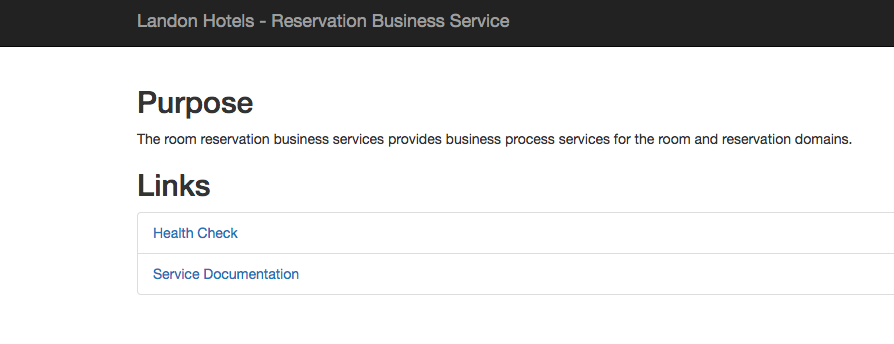

#reservation-business-services

* http://localhost:8500/



* Get http://localhost:8500/rooms

```
[
    {
        "id": 1,
        "name": "Piccadilly",
        "roomNumber": "P1",
        "bedInfo": "1Q"
    },
    {
        "id": 2,
        "name": "Piccadilly",
        "roomNumber": "P2",
        "bedInfo": "1Q"
    },
    {
        "id": 3,
        "name": "Piccadilly",
        "roomNumber": "P3",
        "bedInfo": "1Q"
    },
    {
        "id": 4,
        "name": "Piccadilly",
        "roomNumber": "P4",
        "bedInfo": "2D"
    },
    {
        "id": 5,
        "name": "Piccadilly",
        "roomNumber": "P5",
        "bedInfo": "2D"
    },
    {
        "id": 6,
        "name": "Piccadilly",
        "roomNumber": "P6",
        "bedInfo": "2D"
    },
    {
        "id": 7,
        "name": "Cambridge",
        "roomNumber": "C1",
        "bedInfo": "1K"
    },
    {
        "id": 8,
        "name": "Cambridge",
        "roomNumber": "C2",
        "bedInfo": "1K"
    },
    {
        "id": 9,
        "name": "Cambridge",
        "roomNumber": "C3",
        "bedInfo": "1K"
    },
    {
        "id": 10,
        "name": "Westminster",
        "roomNumber": "W1",
        "bedInfo": "1K"
    },
    {
        "id": 11,
        "name": "Westminster",
        "roomNumber": "W2",
        "bedInfo": "1K"
    },
    {
        "id": 12,
        "name": "Westminster",
        "roomNumber": "W3",
        "bedInfo": "1K"
    },
    {
        "id": 13,
        "name": "Westminster",
        "roomNumber": "W4",
        "bedInfo": "1K"
    },
    {
        "id": 14,
        "name": "Westminster",
        "roomNumber": "W5",
        "bedInfo": "2D"
    },
    {
        "id": 15,
        "name": "Westminster",
        "roomNumber": "W6",
        "bedInfo": "2D"
    },
    {
        "id": 16,
        "name": "Westminster",
        "roomNumber": "W7",
        "bedInfo": "2D"
    },
    {
        "id": 17,
        "name": "Oxford",
        "roomNumber": "O1",
        "bedInfo": "1K"
    },
    {
        "id": 18,
        "name": "Oxford",
        "roomNumber": "O2",
        "bedInfo": "1K"
    },
    {
        "id": 19,
        "name": "Oxford",
        "roomNumber": "O3",
        "bedInfo": "1Q"
    },
    {
        "id": 20,
        "name": "Oxford",
        "roomNumber": "O4",
        "bedInfo": "1Q"
    },
    {
        "id": 21,
        "name": "Oxford",
        "roomNumber": "O5",
        "bedInfo": "1Q"
    },
    {
        "id": 22,
        "name": "Victoria",
        "roomNumber": "V1",
        "bedInfo": "1K"
    },
    {
        "id": 23,
        "name": "Victoria",
        "roomNumber": "V2",
        "bedInfo": "2D"
    },
    {
        "id": 24,
        "name": "Victoria",
        "roomNumber": "V3",
        "bedInfo": "2D"
    },
    {
        "id": 25,
        "name": "Manchester",
        "roomNumber": "M1",
        "bedInfo": "1K"
    },
    {
        "id": 26,
        "name": "Manchester",
        "roomNumber": "M2",
        "bedInfo": "1K"
    },
    {
        "id": 27,
        "name": "Manchester",
        "roomNumber": "M3",
        "bedInfo": "1K"
    },
    {
        "id": 28,
        "name": "Manchester",
        "roomNumber": "M4",
        "bedInfo": "1K"
    }
]
```

* Get http://localhost:8500/roomReservations/2018-06-30

```
[
    {
        "roomId": 1,
        "guestId": 0,
        "roomName": "Piccadilly",
        "roomNumber": "P1",
        "firstName": null,
        "lastName": null,
        "date": null
    },
    {
        "roomId": 2,
        "guestId": 0,
        "roomName": "Piccadilly",
        "roomNumber": "P2",
        "firstName": null,
        "lastName": null,
        "date": null
    },
    {
        "roomId": 3,
        "guestId": 0,
        "roomName": "Piccadilly",
        "roomNumber": "P3",
        "firstName": null,
        "lastName": null,
        "date": null
    },
    {
        "roomId": 4,
        "guestId": 0,
        "roomName": "Piccadilly",
        "roomNumber": "P4",
        "firstName": null,
        "lastName": null,
        "date": null
    },
    {
        "roomId": 5,
        "guestId": 0,
        "roomName": "Piccadilly",
        "roomNumber": "P5",
        "firstName": null,
        "lastName": null,
        "date": null
    },
    {
        "roomId": 6,
        "guestId": 0,
        "roomName": "Piccadilly",
        "roomNumber": "P6",
        "firstName": null,
        "lastName": null,
        "date": null
    },
    {
        "roomId": 7,
        "guestId": 0,
        "roomName": "Cambridge",
        "roomNumber": "C1",
        "firstName": null,
        "lastName": null,
        "date": null
    },
    {
        "roomId": 8,
        "guestId": 0,
        "roomName": "Cambridge",
        "roomNumber": "C2",
        "firstName": null,
        "lastName": null,
        "date": null
    },
    {
        "roomId": 9,
        "guestId": 0,
        "roomName": "Cambridge",
        "roomNumber": "C3",
        "firstName": null,
        "lastName": null,
        "date": null
    },
    {
        "roomId": 10,
        "guestId": 0,
        "roomName": "Westminster",
        "roomNumber": "W1",
        "firstName": null,
        "lastName": null,
        "date": null
    },
    {
        "roomId": 11,
        "guestId": 0,
        "roomName": "Westminster",
        "roomNumber": "W2",
        "firstName": null,
        "lastName": null,
        "date": null
    },
    {
        "roomId": 12,
        "guestId": 0,
        "roomName": "Westminster",
        "roomNumber": "W3",
        "firstName": null,
        "lastName": null,
        "date": null
    },
    {
        "roomId": 13,
        "guestId": 0,
        "roomName": "Westminster",
        "roomNumber": "W4",
        "firstName": null,
        "lastName": null,
        "date": null
    },
    {
        "roomId": 14,
        "guestId": 0,
        "roomName": "Westminster",
        "roomNumber": "W5",
        "firstName": null,
        "lastName": null,
        "date": null
    },
    {
        "roomId": 15,
        "guestId": 0,
        "roomName": "Westminster",
        "roomNumber": "W6",
        "firstName": null,
        "lastName": null,
        "date": null
    },
    {
        "roomId": 16,
        "guestId": 0,
        "roomName": "Westminster",
        "roomNumber": "W7",
        "firstName": null,
        "lastName": null,
        "date": null
    },
    {
        "roomId": 17,
        "guestId": 0,
        "roomName": "Oxford",
        "roomNumber": "O1",
        "firstName": null,
        "lastName": null,
        "date": null
    },
    {
        "roomId": 18,
        "guestId": 0,
        "roomName": "Oxford",
        "roomNumber": "O2",
        "firstName": null,
        "lastName": null,
        "date": null
    },
    {
        "roomId": 19,
        "guestId": 0,
        "roomName": "Oxford",
        "roomNumber": "O3",
        "firstName": null,
        "lastName": null,
        "date": null
    },
    {
        "roomId": 20,
        "guestId": 0,
        "roomName": "Oxford",
        "roomNumber": "O4",
        "firstName": null,
        "lastName": null,
        "date": null
    },
    {
        "roomId": 21,
        "guestId": 0,
        "roomName": "Oxford",
        "roomNumber": "O5",
        "firstName": null,
        "lastName": null,
        "date": null
    },
    {
        "roomId": 22,
        "guestId": 0,
        "roomName": "Victoria",
        "roomNumber": "V1",
        "firstName": null,
        "lastName": null,
        "date": null
    },
    {
        "roomId": 23,
        "guestId": 0,
        "roomName": "Victoria",
        "roomNumber": "V2",
        "firstName": null,
        "lastName": null,
        "date": null
    },
    {
        "roomId": 24,
        "guestId": 0,
        "roomName": "Victoria",
        "roomNumber": "V3",
        "firstName": null,
        "lastName": null,
        "date": null
    },
    {
        "roomId": 25,
        "guestId": 0,
        "roomName": "Manchester",
        "roomNumber": "M1",
        "firstName": null,
        "lastName": null,
        "date": null
    },
    {
        "roomId": 26,
        "guestId": 0,
        "roomName": "Manchester",
        "roomNumber": "M2",
        "firstName": null,
        "lastName": null,
        "date": null
    },
    {
        "roomId": 27,
        "guestId": 0,
        "roomName": "Manchester",
        "roomNumber": "M3",
        "firstName": null,
        "lastName": null,
        "date": null
    },
    {
        "roomId": 28,
        "guestId": 0,
        "roomName": "Manchester",
        "roomNumber": "M4",
        "firstName": null,
        "lastName": null,
        "date": null
    }
]
```