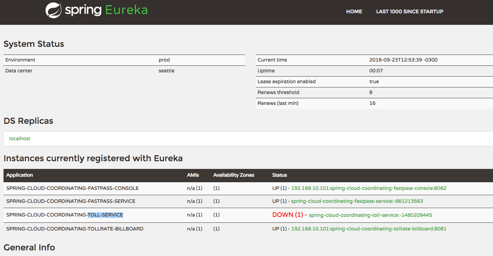
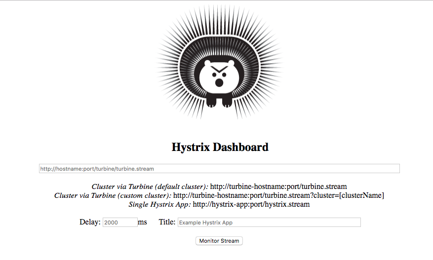
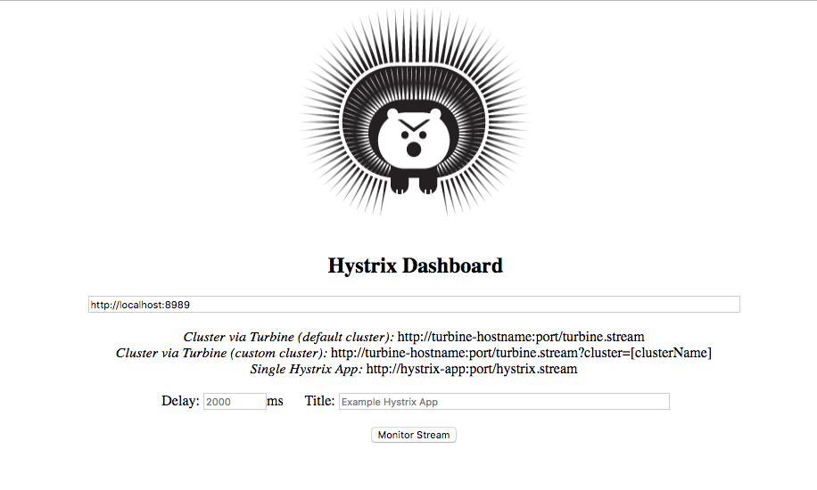
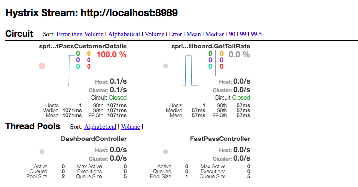

# spring-cloud-coordinating

### Start RabbitMQ

- docker run -d --hostname local-rabbit --name spring-cloud-coordinating-rmq -p 15672:15672 -p 5672:5672 rabbitmq:3.6.9-management

### 1 -  start project eureka-service

### 2 -  start all others projects

- GET http://localhost:8761/

- GET http://localhost:8081/dashboard?stationId=3

- GET http://localhost:8082/customerdetails?fastpassid=101

- GET http://localhost:8085/hystrix

---
GET http://localhost:8085/hystrix

Ip From turbine http://localhost:8989

java -jar stream-tollintake/target/stream-tollintake-0.0.1-SNAPSHOT.jar --spring.cloud.steam.instanceindex=0
--spring.cloud.steam.instanceindex=1